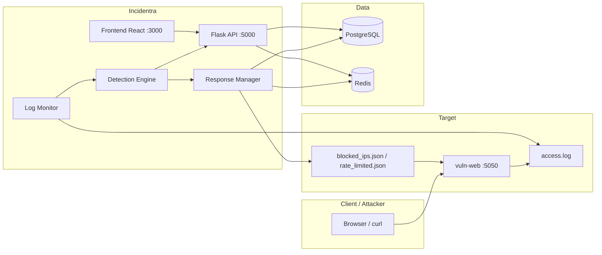

# Incidentra — Architecture & Detection

**Incidentra** is a Web-SOC platform for SMEs: it monitors web application logs, detects attacks (SQLi, XSS, brute force, path traversal, etc.), creates incidents, automatically blocks IPs, and provides a security analyst dashboard.

> Capstone — President University, Faculty of Computer Science  
> Repo: [github.com/HardInCode/incidentra](https://github.com/HardInCode/incidentra)

**Run:** [GUIDE.md](GUIDE.md) · **Audit:** [AUDIT.md](AUDIT.md) · **Deploy:** [additional/DEPLOY.md](additional/DEPLOY.md)

---

## Capabilities Overview

| Area | Capabilities |
|------|-------------|
| Monitoring | Tail `access.log` or simulated demo mode |
| Detection | Regex + DB rules + brute force threshold (Redis); FILE_UPLOAD triggers only on dangerous extensions (.php, .jsp, etc.) |
| Response | Monitor / rate limit / escalating block (high & critical); permanent block only via manual admin action |
| SOC UI | Dashboard, incidents (ongoing vs archived), **IP Management**, rules, live traffic |
| AI | Incident explanation & chatbot (Groq, optional) |
| Threat Intel | AbuseIPDB (optional), email/Telegram notifications |
| Access | JWT, admin & analyst roles, i18n EN/ID, dark theme |
| Deploy | Docker Compose (laptop/VPS) — [additional/DEPLOY.md](additional/DEPLOY.md) |
| Whitelist IP | Skip detection + excluded from `blocked_ips.json` |
| Lab mode | UI rules only; OWASP baseline off |
| CSV Export | `incidents-ongoing.csv` vs `incidents-all.csv` |

---

## Docker vs Manual

| | Docker | Manual |
|---|--------|--------|
| Clone | `git clone` → `copy .env.docker.example .env.docker` | `copy .env.example .env` |
| Env backend | `.env.docker` (secrets) + `docker-compose.yml` (DB/Redis URL) | `backend/.env` |
| DB driver | `postgresql+psycopg://...@postgres:5432/...` | `postgresql+psycopg://...@localhost:5432/...` |
| Log & JSON | Volume `vuln_logs` → `/app/watched_logs` = `/app/logs` | `../vuln-web/logs/` |
| Log monitor | `docker_log_monitor.py` + gunicorn | `python run.py` |
| Frontend API | Build arg `REACT_APP_API_URL` | `package.json` proxy or `.env` |

---

## System Architecture



### Single Log Line Flow

1. **vuln-web** writes HTTP request to `access.log` (combined format + `POST_DATA` for login).
2. **LogTailer** reads new lines.
3. **parse_log_line** → `{ ip, method, path, query, user_agent, status_code }`.
4. **DetectionEngine.analyze** → pattern / brute force / scanner UA (tie-break PATH_TRAVERSAL vs LFI_RFI for `?file=../../` without `php://`).
5. Threat → **Incident** in PostgreSQL + **ResponseManager.respond**.
6. ResponseManager → **BlockedIP** (DB) + **`blocked_ips.json`** / **`rate_limited.json`** + Redis.
7. **vuln-web** `before_request` reads JSON → **403** or **429**.
8. Optional: AI explanation, AbuseIPDB, notifications.

Dedup: IP + attack_type within 5 minutes. After unblock: waiver Redis + clear rate limit + reset brute-force counter.

---

## Data & Storage (PostgreSQL vs JSON vs Redis)

| Store | Contents | Why not all in DB? |
|-------|----------|--------------------|
| **PostgreSQL** | users, incidents, incident_logs, incident_explanations, incident_notes, **blocked_ips**, detection_rules, app_settings, audit_logs | SOC records, queries, reports, relationships |
| **Redis** | brute-force counter, `ratelimit:{ip}`, `blocked:{ip}`, unblock waiver, `rules_dirty`, `escalation_count:{ip}` | Fast state & TTL; not long-term archive |
| **access.log** | Raw vuln-web traffic | High volume; real-time detection source |
| **blocked_ips.json** | List of IPs to 403 at vuln-web | vuln-web **does not** connect to PostgreSQL |
| **rate_limited.json** | Rate limited IPs + `limits.{ip}` (max req, window) | 429 enforcement at vuln-web; synced from UI |

### Dual-write Blocked IP

- **DB** = source for UI (reason, expire, edit, audit, incident_count).
- **JSON** = contract with vuln-web (no restart needed on unblock).

### Rate limit — intentionally without a DB table

By design (Chapter 3 capstone): rate limit is a **temporary enforcement policy**, not a business entity like incidents. Storage:

- **JSON** — vuln-web reads per request.
- **Redis** — TTL enforcement in backend.
- **UI** — **Rate Limited** tab in IP Management (`GET/PATCH/DELETE /api/rate-limited/`).

Unblocking an IP on the Blocked tab also removes its rate limit entry.

### Form 2/3 Alignment (ERD & Flow Diagrams)

| Form 2 Component | Code Implementation |
|-------------------|---------------------|
| `blocked_ips` in ERD | PostgreSQL table + `blocked_ips.json` copy |
| Rate limit in JSON diagram | `rate_limited.json` + Redis (no separate table) |
| `incident_logs.action_taken` | Records "rate limiting applied" / block — does not replace the rate limit table |

**Why blocked IP in DB but rate limit is not?**

- **Blocked IP (high/critical):** needs SOC metadata (reason, expire, edit from UI, incident count, audit). That fits a relational DB.
- **Rate limit (medium):** inherently **temporary**; Form 2 places enforcement in JSON so vuln-web reads without a DB connection. History is available through `incident` + `incident_logs`, not a `rate_limited_ips` table.

**Both still use JSON** for vuln-web — blocked IP is **also** written to `blocked_ips.json` after being saved in DB (dual-write).

### JSON Security — can it be bypassed?

**Yes, if an attacker has write access to the log folder on the same server** as vuln-web (e.g., shell in the container/host). They could edit `blocked_ips.json` / `rate_limited.json` and remove their IP.

For this **capstone lab** this is acceptable with the assumption:

- The attacker only sends HTTP, and does not have SSH/RCE to the SOC server.
- JSON files are in a shared volume with restricted permissions.

Production mitigation (mention in Chapter 4 as *future work*): strict file permissions, WAF in front of app, enforcement in reverse proxy, or vuln-web reading policy from an internal API instead of a world-writable file.

Dashboard charts use **`Incident.created_at`** — not log contents. Chart demo: `scripts/seed_chart_demo.py`.

DB schema is created with `db.create_all()` (no separate Alembic migrations). See [additional/LEARNING.md](additional/LEARNING.md).

---

## Repository Components

```
incidentra/
├── backend/           Flask API, detection, response_manager
├── frontend/          React 18 + MUI
├── vuln-web/          Target lab + enforcement JSON
├── scripts/           reset, seed, init SQL
├── docs/              Documentation
├── docker-compose.yml
└── README.md
```

### Backend (`backend/app/`)

| Module | Role |
|--------|------|
| `core/log_parser.py` | Parse log, LogTailer, SimulatedLogFeeder |
| `core/log_monitor.py` | Detection pipeline |
| `core/detection_engine.py` | OWASP patterns + brute force + DB rules |
| `core/response_manager.py` | Severity → action + JSON sync |
| `core/settings_reader.py` | Threshold + `is_lab_mode_ui_only()` |
| `api/incidents.py` | CRUD, bulk, export CSV |
| `api/blocked_ips.py` | Block + sync JSON |
| `api/rate_limited.py` | Manage rate limit (JSON/Redis) |
| `api/dashboard.py` | Stats, timeline |
| `api/detection.py` | Simulate (Mode A), inject-log (Mode B), test payload |
| `api/rules.py` | Detection rules CRUD |
| `api/traffic.py` | Live traffic with heuristic tags |
| `api/auth.py` | Login, JWT |
| `api/auth_middleware.py` | Token verification middleware |
| `api/settings.py` | App settings CRUD |
| `api/audit.py` | Audit log listing |
| `api/chatbot.py` | Groq chatbot assistant |
| `api/ip_history.py` | IP history drawer data |
| `api/notifications.py` | Notification endpoints |
| `services/ai_service.py` | Groq AI explanation with fallback |
| `services/audit_service.py` | Audit logging helper |
| `services/notification_service.py` | Email + Telegram alerts |
| `services/threat_intel_service.py` | AbuseIPDB lookup |
| `utils/seeder.py` | Seed users, rules, settings on startup |

Entry: `run.py` (manual) · `docker_entrypoint.sh` + gunicorn (Docker).

### Frontend (`frontend/src/`)

| Page | Route | Notes |
|------|-------|-------|
| Dashboard | `/` | Timeline, MTTR |
| Incidents | `/incidents` | Ongoing |
| All Incidents | `/incidents/all` | Archived |
| Incident Detail | `/incidents/:id` | AI, notes |
| **IP Management** | `/blocked-ips` | Tab **Blocked** \| **Rate Limited** |
| Rules | `/rules` | |
| Live Traffic | `/traffic` | Heuristic tags only |
| Settings | `/settings` | |
| Audit Log | `/audit` | Admin |
| Login | `/login` | |

| Component | Location | Notes |
|-----------|----------|-------|
| Chatbot | `components/shared/ChatbotWidget.js` | Draggable, `/api/chatbot` |
| Session timeout | `components/shared/SessionTimeoutWarning.js` | Idle warning overlay |
| IP History | `components/shared/IPHistoryDrawer.js` | Drawer from IP click, `/api/ip/<ip>/history` |
| Notification bell | `components/shared/NotificationBell.js` | Toast + badge count |
| Simulate dialog | `components/incidents/SimulateDialog.js` | Mode A / Mode B |
| Filter bar | `components/shared/FilterBar.js` | Reusable filter component |
| Date range filter | `components/shared/DateRangeFilter.js` | Date picker filter |
| Layout | `components/shared/Layout.js` | Sidebar + app shell |

### Vuln-web

Vulnerable target + JSON middleware (403/429). Per-IP rate policy from `limits` in `rate_limited.json`.

**Lab configuration (`vuln-web/config.py`, file `vuln-web/.env`):**

| Variable | Effect when `1` / `true` / `yes` |
|----------|----------------------------------|
| `VULN_UNSAFE_CMD` | `/cmd` → `subprocess` real shell (timeout `VULN_CMD_TIMEOUT`, default 5s) |
| `VULN_UNSAFE_UPLOAD` | POST `/files` allows saving outside `safe_files/` via `../` in filename |

Without flags: `/cmd` is simulated; `/profile` avatar has no extension filter (CTF scenario). **Restart** vuln-web after changing `.env`. Docker: set env in `docker-compose.yml` service `vuln_web` (`.env` is not auto-read by the container).

**Vuln-web routes:** `main.py` (home), `shop.py` (catalog), `cart.py` (cart), `auth.py` (login), `files.py` (file upload/download), `cmd.py` (command), `profile.py` (avatar), `api.py` (REST).

**Vuln-web middleware:** `security.py` (read `blocked_ips.json` / `rate_limited.json` → 403/429), `logging.py` (write `access.log`).

---

## Live Traffic vs Incidents vs Blocking

Three separate layers:

1. **Log** — every vuln-web request → `vuln-web/logs/access.log`.
2. **Live Traffic (tag)** — `traffic.py` tags patterns quickly (e.g., `cmd=` → Attack). Status **200** + tag Attack **does not** mean the IP is blocked.
3. **Incidents + enforcement** — `DetectionEngine` → PostgreSQL → `ResponseManager` writes `blocked_ips.json` → vuln-web middleware returns **403**.

Demo & troubleshooting: [GUIDE.md](GUIDE.md). Phase 3 (`VULN_UNSAFE_CMD=1`) only changes vuln-web behavior; detection/blocking still via SOC backend.

---

## Security Response Model

| Level | Severity | Action |
|-------|----------|--------|
| 1 | low | Log & monitor |
| 2 | medium | Rate limit (JSON + Redis) |
| 3 | high | Escalating block (`TEMP_BLOCK_DURATION`, default 86400 s) |
| 4 | critical | Escalating block + notification |

Env: `BRUTE_FORCE_THRESHOLD`, `RATE_LIMIT_MAX_REQUESTS`, `RATE_LIMIT_WINDOW` — global defaults; override per IP via UI Rate Limited tab.

### Escalating Block Policy

| Severity | Auto action | Default duration (offense 1 → 2 → 3+) |
|----------|-------------|---------------------------------------|
| low | log & monitor | — |
| medium | rate limit | — |
| high | `escalating_block` | 1h → 24h → 7d |
| critical | `escalating_block` | 24h → 7d → 30d |

- **No automatic permanent block** — permanent only via **manual block** in IP Management.
- Offense ≥ threshold → badge **Repeat Offender** (`is_repeat_offender=True`).
- Unblock IP **does not** reset the escalation counter — stored in Redis (`escalation_count:{ip}`) for 30 days.
- The highest severity ever recorded for an IP determines which duration list applies (critical list wins over high).

---

## Detection Engine

### Two Different Things (do not conflate)

| Layer | Function | Primary file |
|-------|----------|-------------|
| **Incident detection** | Regex + brute-force → incident + IP block | `backend/app/core/detection_engine.py` |
| **AI analyst** | Incident explanation for humans (Groq) | `backend/app/services/ai_service.py` |

**AI fallback** = if Groq fails → static text `fallback-static` (not attack detection).

**OWASP baseline** = built-in regex in `DETECTION_PATTERNS` (not AI). Default **always merged** with UI rules.

### Detection Flow

```
vuln-web → access.log → log_monitor → parse_log_line → DetectionEngine.analyze()
    → Incident (PostgreSQL) → ResponseManager → blocked_ips.json / rate_limited.json
    → vuln-web 403/429 on next request
```

Optional (async): `ai_service` → `IncidentExplanation` (does not affect blocking).

### Attack Types & Severity

| Attack Type | Default Severity | Auto Response |
|-------------|------------------|---------------|
| SQL_INJECTION | critical | Escalating block (offense #1 ≈ 24h) |
| XSS | critical | Escalating block |
| COMMAND_INJECTION | critical | Escalating block |
| LFI_RFI | critical | Escalating block |
| BRUTE_FORCE | high | Escalating block |
| PATH_TRAVERSAL | high | Escalating block |
| FILE_UPLOAD | high | Escalating block |
| SCANNER | medium | Rate limit |
| CSRF | medium | Rate limit |

### Three Detection Sources (defense presentation)

| Source | File / UI | When active |
|--------|-----------|-------------|
| **UI Rule** | Detection Rules → PostgreSQL | Rule `is_active=true` |
| **OWASP Baseline** | `detection_engine.py` → `DETECTION_PATTERNS` | Default (Lab mode **OFF**) |
| **AI analyst** | `ai_service.py` (Groq) | Explanation only — **does not** block |

### Code Comments Index (Ctrl+F for defense presentation)

Search `SIDANG Ctrl+F` in `backend/app/core/`, `backend/app/api/traffic.py`, `vuln-web/middleware/security.py`, `frontend/src/pages/Incidents.js`, `IPHistoryDrawer.js`.

| Search string | Meaning |
|---------------|---------|
| `OWASP_BASELINE_PATTERNS` | Comment marker in `detection_engine.py` |
| `DETECTION_PATTERNS` | Built-in pattern dict (SQLi, XSS, CMD, …) |
| `_load_rules_from_db` | Load active rules from PostgreSQL |
| `is_lab_mode_ui_only` | Lab mode: UI rules only |
| `DetectionEngine.analyze` | Entry point for per-log-line detection |
| `BruteForceTracker` | Brute force (threshold) |
| `RESPONSE_ACTIONS` | Severity → monitor / rate_limit / escalating_block |
| `enforce_security` | vuln-web reads `blocked_ips.json` → 403 |
| `_call_groq_with_fallback` | Groq model chain for AI explanation |
| `DETECTION_LAB_MODE_UI_ONLY` | Setting in Settings (DB) |

### Lab Mode (Settings)

| Setting | Default | Effect |
|---------|---------|--------|
| **Lab mode OFF** | Yes (production/general demo) | UI rules **+** baseline `DETECTION_PATTERNS` |
| **Lab mode ON** | No | Only **active** rules in Detection Rules; OWASP baseline **off**; brute force only if a BRUTE_FORCE rule is active |

**Docker:** no image rebuild needed; save Settings → backend applies within ≈60 seconds (or restart `backend` for immediate effect).

**Defense demo (custom rule):**

1. Settings → enable **Lab mode** → Save.
2. Detection Rules → create rule e.g., SQLi `(?i)lorem\s+ipsum` → active.
3. Unblock IP in IP Management.
4. POST `/login` with `username=lorem ipsum` → incident from **your rule**.
5. Disable rule / lab mode → behavior returns to baseline (if only the rule is OFF, baseline still detects unless lab mode is ON).

### Detection Thresholds (Settings)

| Field | Used in |
|-------|---------|
| Brute Force Threshold | `BruteForceTracker` — failed POST to `/login` |
| Rate Limit Window | Brute force window + rate limit policy |
| Repeat Offender Threshold | Offense count before **Repeat Offender** badge |
| Escalating High Durations | Block duration per offense tier (High): default `1, 24, 168` hours |
| Escalating Critical Durations | Block duration per offense tier (Critical): default `24, 168, 720` hours |
| Temp Block Duration | Legacy/manual temporary block (hours × 3600 → seconds) |

Values are read from **AppSetting** (after Save) then `.env` as fallback.

### HTTP 429 at vuln-web

Appears when an IP is in `rate_limited.json` **and** exceeds `max_requests` within `window_seconds` (default 10 req / 60 s).

Typical trigger: **SCANNER** incident (severity medium) → `rate_limit`, not permanent block.

### Rate Limited tab — "Listed in rate_limited.json only"

Means the IP is recorded in the JSON enforcement file, but the Redis key `ratelimit:{ip}` has no TTL (Redis restart, new worker, or Redis down). **vuln-web still rate-limits** using JSON + request counting in middleware.

### Live Traffic vs Incidents

| | Live Traffic | Incidents |
|--|--------------|-----------|
| File | `backend/app/api/traffic.py` | `detection_engine.py` |
| Tag Attack | Lightweight keyword match | — |
| Incident | — | Full regex + brute force |

SQLi can be tagged **Normal** in Live Traffic but still create an incident if the engine pattern matches.

### Security Lab (vuln-web Phase 3)

**Docker Compose (default in repo):** `VULN_UNSAFE_CMD=1` and `VULN_UNSAFE_UPLOAD=1` on service `vuln_web` — red banner on shop pages; real shell on `/cmd`; upload path escape when upload flag is on.

| Flag | Effect |
|------|--------|
| `VULN_UNSAFE_CMD=1` | `/cmd?cmd=...` runs `subprocess` (timeout 5s) |
| `VULN_UNSAFE_UPLOAD=1` | POST `/files` may write outside `safe_files/uploads/` |

**Whitelist IP:** `BlockedIP.is_whitelist=True` → excluded from `blocked_ips.json`; `DetectionEngine.analyze` returns `None` for that IP (no new incidents).

**PATH_TRAVERSAL / FILE_UPLOAD / BRUTE_FORCE:** severity **high** → escalating block (not permanent). **SQL_INJECTION / XSS / COMMAND_INJECTION / LFI_RFI:** severity **critical** → escalating block (offense #1 default 24 hours, not permanent).

**Absolute path on `/files`:** `?file=E:/.../blocked_ips.json` or `/app/logs/...` may read files without `../` — may not match classic traversal regex; optional custom rule: `blocked_ips\.json`, `[/\\]logs[/\\]`.

**Demo flag file (Docker slim):** `cmd=cat lab_secrets/capstone_flag.txt` works; `ping` often missing in image — not a detection failure.

Full lab payloads and bypass notes: see [GUIDE.md](GUIDE.md) Phase 3 section and [AUDIT.md](AUDIT.md) section G.

---

## API Reference (`/api`)

Auth: `Authorization: Bearer <token>` except login.

### Auth

| Method | Endpoint | Description |
|--------|----------|-------------|
| POST | `/auth/login` | Login, returns JWT token |
| GET | `/auth/me` | Current user info |

### Incidents

| Method | Endpoint | Description |
|--------|----------|-------------|
| GET | `/incidents/` | Filter, sort, paginate |
| PUT | `/incidents/<id>/status` | Change status |
| PATCH | `/incidents/bulk-status` | Admin bulk resolve |
| GET | `/incidents/export` | CSV export |

### IP Management

| Method | Endpoint | Description |
|--------|----------|-------------|
| GET/POST/PATCH/DELETE | `/blocked-ips/` | Block (DB + JSON) |
| GET | `/rate-limited/` | List rate limits + TTL |
| PATCH | `/rate-limited/<ip>` | Extend TTL, max_requests, window |
| DELETE | `/rate-limited/<ip>` | Clear rate limit |

### Detection

| Method | Endpoint | Description |
|--------|----------|-------------|
| POST | `/detection/simulate` | Mode A — direct simulation |
| POST | `/detection/inject-log` | Mode B — log injection (full pipeline) |
| POST | `/detection/test` | Test payload against engine |

### IP History

| Method | Endpoint | Description |
|--------|----------|-------------|
| GET | `/ip/<ip>/history` | IP history for drawer |

### Other

| Method | Endpoint | Description |
|--------|----------|-------------|
| GET | `/dashboard/stats` | Dashboard statistics |
| GET/PUT | `/rules` | Detection rules CRUD |
| GET | `/traffic/recent` | Live traffic data |
| GET/PUT | `/settings` | App settings |
| GET | `/audit` | Audit log |
| POST | `/chatbot` | Groq chatbot |
| GET | `/notifications` | Notification data |

---

## User Roles

| Feature | Admin | Analyst |
|---------|:-----:|:-------:|
| Dashboard & incidents | ✓ | ✓ |
| Bulk resolve | ✓ | ✗ |
| IP Management (block / rate limit) | ✓ | View only |
| Rules / settings | ✓ | Limited |
| Audit log | ✓ | ✗ |

---

## Optional Integrations

| Service | Env | If empty |
|---------|-----|----------|
| Groq | `GROQ_API_KEY` in `.env` / `.env.docker` | Fallback explanation |
| AbuseIPDB | Settings / env | Skip IP reputation |
| SMTP / Telegram | env / Settings | No alerts |

Celery is available; notifications/AI have thread fallback if the worker is not running.

---

## Log Monitor Modes

| `USE_SIMULATED_LOGS` | `DEMO_MODE` | Behavior |
|----------------------|-------------|----------|
| `true` | `true` | Feeder runs once |
| `true` | `false` | Feeder loops |
| `false` | — | Tail real log |

---

## Development Status (July 2026)

| Feature | Status |
|---------|--------|
| Edit block duration (UI) | ✅ |
| IP Management + rate limit UI | ✅ |
| Per-IP max requests / window | ✅ (JSON `limits`) |
| Docker Compose end-to-end | ✅ |
| Notification bell + chatbot + session timeout | ✅ |
| Ongoing vs All Incidents + IP History drawer | ✅ |
| Whitelist IP + bulk resolve (admin) | ✅ |
| Incident grouping (correlation) | 🔲 Optional Chapter 4+ |

---

## Team

| Name | NIM | Role |
|------|-----|------|
| Hardin Irfan | 001202300066 | Project Lead, Backend & Frontend |
| Zaidan Mahfudz Azzam Saidi | 001202300144 | Security, QA & Testing |

---

## Team Guide — Five Layers (Defense Mastery)

```
[L1] Browser  →  HTTP to vuln-web :5050
[L2] vuln-web →  access.log + read blocked_ips.json / rate_limited.json
[L3] Backend  →  tail log → detection → PostgreSQL + write JSON
[L4] Frontend →  SOC dashboard :3000
[L5] Infra    →  PostgreSQL + Redis (+ Docker or local services)
```

**Golden rule:** Incidents & rules = **L3 + PostgreSQL**. HTTP blocking at target = **L2 + JSON**. Live Traffic = log mirror, **not** the final block decision.

### Full Flow (SQLi login → 403)

1. Browser `POST /login` with SQLi payload → vuln-web writes line to `access.log` (+ `POST_DATA`).
2. `LogTailer` reads new line → `parse_log_line()`.
3. `DetectionEngine.analyze()` → `SQL_INJECTION` (DB rules + baseline, unless Lab mode ON).
4. Whitelist check: if IP `is_whitelist=True` → **no** incident.
5. `log_monitor` inserts `Incident` (dedup 5 min per IP + attack_type).
6. `ResponseManager` → high/critical → `escalating_block` → `BlockedIP` (`block_type='temporary'`, escalating duration) + `_write_blocked_ips.json()`. Permanent block only via admin manual action.
7. Analyst sees incident at `/incidents` (ongoing).
8. Next request from same IP to vuln-web → middleware → **HTTP 403**.
9. Live Traffic: first line shows **Attack 200**, subsequent lines show **Blocked 403**.

### Manual vs Docker (new team member)

| Aspect | Manual | Docker |
|--------|--------|--------|
| Postgres | Local Windows service | Container — **separate data** from Windows Postgres |
| Log + JSON | `vuln-web/logs/` | Volume `vuln_logs` |
| Phase 3 | `vuln-web/.env` + restart | `environment:` in `docker-compose.yml` |
| Reset log | `--clear-logs` directly | `docker compose exec vuln_web` (see [GUIDE.md](GUIDE.md)) |

**Port 5432 conflict** if both Windows Postgres and the container are active.

### Docker — Six Containers

`docker compose up` runs: `postgres`, `redis`, `vuln_web`, `backend`, `frontend`, `celery_worker`. Volume `vuln_logs` is mounted to `/app/logs` (vuln-web) and `/app/watched_logs` (backend). Application logic is **the same** as manual; only packaging differs.

### Backend Modules (Quick Reference)

| File | Function |
|------|----------|
| `log_parser.py` | `parse_log_line`, `LogTailer` |
| `log_monitor.py` | Pipeline: parse → analyze → incident |
| `detection_engine.py` | Patterns, lab mode, whitelist skip, brute force |
| `response_manager.py` | Severity → action + dual-write JSON |
| `settings_reader.py` | Threshold + `is_lab_mode_ui_only()` |
| `api/incidents.py` | List, `list_scope`, export, bulk, simulate |
| `api/blocked_ips.py` | Block, unblock, whitelist upsert |
| `api/ip_history.py` | Drawer per IP |
| `api/traffic.py` | Heuristic tag (not detection) |
| `api/chatbot.py` | Groq assistant |
| `api/detection.py` | Simulate, inject-log, test payload |

### Frontend (July 2026)

| Route | Notes |
|-------|-------|
| `/incidents` | Ongoing: `new`, `investigating` |
| `/incidents/all` | Archived: resolved / false_positive |
| `/blocked-ips` | IP Management — Blocked \| Rate Limited |
| Global widgets | `NotificationBell`, `ChatbotWidget`, `SessionTimeoutWarning` |
| Drawer | `IPHistoryDrawer` from IP click |

### Team FAQ (Summary)

| Q | A |
|---|---|
| Rules in JSON? | **No** — `detection_rules` in PostgreSQL |
| Live Traffic Attack but no 403? | Heuristic tag; check **Incidents** + JSON |
| PATH_TRAVERSAL permanent? | **No** — high → escalating **temporary** block |
| Whitelist? | No detection; not in `blocked_ips.json` |
| Export ongoing vs all? | Different files + `list_scope` filter |
| Groq required? | No — `fallback-static` |
| Celery required? | No — thread fallback for notifications |
| Postgres Docker vs Windows? | Different instances — data not shared |
| Reading order for new members? | ARCHITECTURE (this) → GUIDE → AUDIT |

### Glossary

| Term | Meaning |
|------|---------|
| SOC | Security Operations Center |
| Dual-write | `BlockedIP` in DB + copy to `blocked_ips.json` |
| Lab mode | UI rules only; OWASP baseline off |
| Heuristic | Live Traffic tag — can be Attack 200 without block |
| `list_scope` | `ongoing` \| `all` for listing/exporting incidents |

---

*Architecture & Detection — Incidentra, July 2026.*
