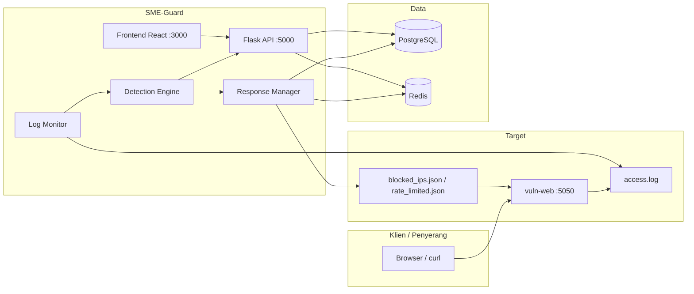

# SME-Guard — Architecture & Application

**SME-Guard** adalah platform Web-SOC untuk UKM: memantau log aplikasi web, mendeteksi serangan (SQLi, XSS, brute force, path traversal, dll.), membuat insiden, memblokir IP otomatis, dan menampilkan dashboard analis keamanan.

> Capstone — President University, Faculty of Computer Science  
> Repo: [github.com/HardInCode/sme-guard](https://github.com/HardInCode/sme-guard)

**Run:** [GUIDE.md](GUIDE.md) · **Detection:** [DETECTION.md](DETECTION.md) · **Audit:** [AUDIT.md](AUDIT.md) · **Deploy:** [additional/DEPLOY.md](additional/DEPLOY.md)

---

## Ringkasan kemampuan

| Area | Kemampuan |
|------|-----------|
| Monitoring | Tail `access.log` atau mode simulasi demo |
| Deteksi | Regex + aturan DB + threshold brute force (Redis); FILE_UPLOAD hanya ekstensi berbahaya (.php, .jsp, dll.) |
| Respons | Monitor / rate limit / blokir temp / blokir permanen |
| SOC UI | Dashboard, insiden (ongoing vs arsip), **IP Management**, rules, live traffic |
| AI | Penjelasan insiden & chatbot (Groq, opsional) |
| Intel | AbuseIPDB (opsional), notifikasi email/Telegram |
| Akses | JWT, peran admin & analyst, i18n EN/ID, dark theme |
| Deploy | Docker Compose (laptop/VPS) — [additional/DEPLOY.md](additional/DEPLOY.md) |
| Whitelist IP | Skip deteksi + tidak masuk `blocked_ips.json` |
| Lab mode | UI rules only; baseline OWASP off |
| Export CSV | `incidents-ongoing.csv` vs `incidents-all.csv` |

---

## Docker vs manual

| | Docker | Manual |
|---|--------|--------|
| Clone | `git clone` → `copy .env.docker.example .env.docker` | `copy .env.example .env` |
| Env backend | `.env.docker` (secrets) + `docker-compose.yml` (DB/Redis URL) | `backend/.env` |
| DB driver | `postgresql+psycopg://...@postgres:5432/...` | `postgresql+psycopg://...@localhost:5432/...` |
| Log & JSON | Volume `vuln_logs` → `/app/watched_logs` = `/app/logs` | `../vuln-web/logs/` |
| Log monitor | `docker_log_monitor.py` + gunicorn | `python run.py` |
| Frontend API | Build arg `REACT_APP_API_URL` | `package.json` proxy atau `.env` |

---

## Arsitektur sistem



### Alur satu baris log

1. **vuln-web** mencatat HTTP ke `access.log` (format combined + `POST_DATA` untuk login).
2. **LogTailer** membaca baris baru.
3. **parse_log_line** → `{ ip, method, path, query, user_agent, status_code }`.
4. **DetectionEngine.analyze** → pola / brute force / scanner UA (tie-break PATH_TRAVERSAL vs LFI_RFI untuk `?file=../../` tanpa `php://`).
5. Ancaman → **Incident** di PostgreSQL + **ResponseManager.respond**.
6. ResponseManager → **BlockedIP** (DB) + **`blocked_ips.json`** / **`rate_limited.json`** + Redis.
7. **vuln-web** `before_request` baca JSON → **403** atau **429**.
8. Opsional: AI explanation, AbuseIPDB, notifikasi.

Dedup: IP + attack_type dalam 5 menit. Setelah unblock: waiver Redis + clear rate limit + reset brute-force counter.

---

## Data & penyimpanan (PostgreSQL vs JSON vs Redis)

| Store | Isi | Mengapa tidak semua di DB? |
|-------|-----|----------------------------|
| **PostgreSQL** | users, incidents, incident_logs, explanations, notes, **blocked_ips**, detection_rules, app_settings, audit_logs | Rekaman SOC, query, laporan, relasi |
| **Redis** | brute-force counter, `ratelimit:{ip}`, `blocked:{ip}`, waiver unblock, `rules_dirty` | State cepat & TTL; bukan arsip jangka panjang |
| **access.log** | Traffic mentah vuln-web | Volume besar; sumber deteksi real-time |
| **blocked_ips.json** | Daftar IP yang harus 403 di vuln-web | vuln-web **tidak** connect ke PostgreSQL |
| **rate_limited.json** | Daftar IP rate limit + `limits.{ip}` (max req, window) | Enforcement 429 di vuln-web; disinkron dari UI |

### Dual-write Blocked IP

- **DB** = sumber untuk UI (reason, expire, edit, audit, incident_count).
- **JSON** = kontrak ke vuln-web (tanpa restart saat unblock).

### Rate limit — sengaja tanpa tabel DB

Sesuai desain sejak Bab 3 capstone: rate limit adalah **kebijakan enforcement sementara**, bukan entitas bisnis seperti insiden. Penyimpanan:

- **JSON** — vuln-web baca per request.
- **Redis** — TTL penegakan backend.
- **UI** — tab **Rate Limited** di IP Management (`GET/PATCH/DELETE /api/rate-limited/`).

Unblock IP di tab Blocked juga menghapus entry rate limit.

### Keselarasan Form 2/3 (ERD & diagram alur)

Diagram capstone Anda sudah benar secara konsep:

| Komponen Form 2 | Implementasi kode |
|-----------------|-------------------|
| `blocked_ips` di ERD | Tabel PostgreSQL + salinan `blocked_ips.json` |
| Rate limit di diagram JSON | `rate_limited.json` + Redis (tanpa tabel terpisah) |
| `incident_logs.action_taken` | Mencatat "rate limiting applied" / blokir — bukan menggantikan tabel rate limit |

**Mengapa blocked IP di DB tetapi rate limit tidak?**

- **Blocked IP (high/critical):** butuh metadata SOC (alasan, expire, edit dari UI, jumlah insiden, audit). Itu cocok di relational DB.
- **Rate limit (medium):** sifatnya **sementara**; Form 2 menempatkan enforcement di JSON agar vuln-web baca tanpa koneksi DB. Histori ada lewat `incident` + `incident_logs`, bukan tabel `rate_limited_ips`.

**Keduanya tetap pakai JSON** untuk vuln-web — blocked IP **juga** ditulis ke `blocked_ips.json` setelah disimpan di DB (dual-write).

### Keamanan JSON — apakah bisa dibypass?

**Ya, jika penyerang punya akses tulis ke folder log di server yang sama** dengan vuln-web (mis. shell di container/host). Mereka bisa mengedit `blocked_ips.json` / `rate_limited.json` dan menghapus IP mereka.

Untuk **capstone lab** ini dapat diterima dengan asumsi:

- Penyerang hanya mengirim HTTP, tidak punya SSH/RCE ke server SOC.
- File JSON di volume bersama dengan permission terbatas.

Mitigasi produksi (sebut di Bab 4 sebagai *future work*): permission file ketat, WAF di depan app, enforcement di reverse proxy, atau vuln-web baca policy dari API internal — bukan file world-writable.

Demo lengkap path traversal, path absolut Windows, dan bypass edit JSON: **[DETECTION.md](DETECTION.md)** § Security Lab.

Grafik Dashboard memakai **`Incident.created_at`** — bukan isi log. Demo grafik: `scripts/seed_chart_demo.py`.

Skema DB dibuat dengan `db.create_all()` (bukan migrasi Alembic terpisah). Lihat [additional/LEARNING.md](additional/LEARNING.md).

---

## Komponen repositori

```
sme-guard/
├── backend/           Flask API, detection, response_manager
├── frontend/          React 18 + MUI
├── vuln-web/          Target lab + enforcement JSON
├── scripts/           reset, seed, init SQL
├── docs/              Dokumentasi
├── docker-compose.yml
└── README.md
```

### Backend (`backend/app/`)

| Modul | Peran |
|-------|--------|
| `core/log_parser.py` | Parse log, LogTailer, SimulatedLogFeeder |
| `core/log_monitor.py` | Pipeline deteksi |
| `core/detection_engine.py` | Pola OWASP + brute force |
| `core/response_manager.py` | Severity → aksi + sinkron JSON |
| `api/incidents.py` | CRUD, bulk, export CSV |
| `api/blocked_ips.py` | Blokir + sync JSON |
| `api/rate_limited.py` | Kelola rate limit (JSON/Redis) |
| `api/dashboard.py` | Stats, timeline |
| `api/rules.py`, `traffic.py`, `auth.py`, `settings.py`, `audit.py` | SOC standar |

Entry: `run.py` (manual) · `docker_entrypoint.sh` + gunicorn (Docker).

### Frontend

| Halaman | Route | Catatan |
|---------|-------|---------|
| Dashboard | `/` | Timeline, MTTR |
| Incidents | `/incidents` | Ongoing |
| All Incidents | `/incidents/all` | Arsip |
| Incident Detail | `/incidents/:id` | AI, catatan |
| **IP Management** | `/blocked-ips` | Tab **Blocked** \| **Rate Limited** |
| Rules | `/rules` | |
| Live Traffic | `/traffic` | Heuristic tags only — see [DETECTION.md](DETECTION.md) |
| Chatbot | widget | `ChatbotWidget.js`, `/api/chatbot` |
| Session timeout | overlay | `SessionTimeoutWarning.js` |
| IP History | drawer | `IPHistoryDrawer.js`, `/api/ip/<ip>/history` |
| Settings | `/settings` | |
| Audit Log | `/audit` | Admin |

### Vuln-web

Target rentan + middleware JSON (403/429). Per-IP rate policy dari `limits` di `rate_limited.json`.

**Konfigurasi lab (`vuln-web/config.py`, file `vuln-web/.env`):**

| Variabel | Efek jika `1` / `true` / `yes` |
|----------|--------------------------------|
| `VULN_UNSAFE_CMD` | `/cmd` → `subprocess` shell nyata (timeout `VULN_CMD_TIMEOUT`, default 5s) |
| `VULN_UNSAFE_UPLOAD` | POST `/files` boleh simpan di luar `safe_files/` via `../` di nama file |

Tanpa flag: `/cmd` simulated; `/profile` avatar tetap tanpa filter ekstensi (CTF). **Restart** vuln-web setelah ubah `.env`. Docker: set env di `docker-compose.yml` service `vuln_web` (`.env` tidak otomatis masuk container).

---

## Live Traffic vs insiden vs blokir

Tiga lapisan terpisah:

1. **Log** — setiap request vuln-web → `vuln-web/logs/access.log`.
2. **Live Traffic (tag)** — `traffic.py` menandai pola cepat (mis. `cmd=` → Attack). Status **200** + tag Attack **tidak** berarti IP diblokir.
3. **Insiden + enforcement** — `DetectionEngine` → PostgreSQL → `ResponseManager` menulis `blocked_ips.json` → middleware vuln-web mengembalikan **403**.

Demo & troubleshooting: [GUIDE.md](GUIDE.md). Phase 3 (`VULN_UNSAFE_CMD=1`) only changes vuln-web behavior; detection/blocking still via SOC backend.

---

## Model respons keamanan

| Level | Severity | Tindakan |
|-------|----------|----------|
| 1 | low | Log & monitor |
| 2 | medium | Rate limit (JSON + Redis) |
| 3 | high | Blokir sementara (`TEMP_BLOCK_DURATION`, default 86400 s) |
| 4 | critical | Blokir permanen + notifikasi |

Env: `BRUTE_FORCE_THRESHOLD`, `RATE_LIMIT_MAX_REQUESTS`, `RATE_LIMIT_WINDOW` — global; override per IP lewat UI Rate Limited.

---

## API utama (`/api`)

Auth: `Authorization: Bearer <token>` kecuali login.

### Insiden

| Method | Endpoint | Keterangan |
|--------|----------|------------|
| GET | `/incidents/` | Filter, sort, page |
| PUT | `/incidents/<id>/status` | Ubah status |
| PATCH | `/incidents/bulk-status` | Admin bulk resolve |
| GET | `/incidents/export` | CSV |

### IP Management

| Method | Endpoint | Keterangan |
|--------|----------|------------|
| GET/POST/PATCH/DELETE | `/blocked-ips/` | Blokir (DB + JSON) |
| GET | `/rate-limited/` | Daftar rate limit + TTL |
| PATCH | `/rate-limited/<ip>` | Extend TTL, max_requests, window |
| DELETE | `/rate-limited/<ip>` | Clear rate limit |

### Lainnya

`GET /dashboard/stats` · `GET/PUT /rules` · `GET /traffic/recent` · `POST /detection/simulate` · `GET/PUT /settings` · `GET /audit` · `POST /chatbot`

---

## Peran pengguna

| Fitur | Admin | Analyst |
|-------|:-----:|:-------:|
| Dashboard & insiden | ✓ | ✓ |
| Bulk resolve | ✓ | ✗ |
| IP Management (block / rate limit) | ✓ | lihat saja |
| Rules / settings | ✓ | terbatas |
| Audit log | ✓ | ✗ |

---

## Integrasi opsional

| Layanan | Env | Jika kosong |
|---------|-----|-------------|
| Groq | `GROQ_API_KEY` di `.env` / `.env.docker` | Fallback penjelasan |
| AbuseIPDB | Settings / env | Skip reputasi IP |
| SMTP / Telegram | env / Settings | Tanpa alert |

Celery ada; notifikasi/AI punya fallback thread jika worker tidak jalan.

---

## Mode log monitor

| `USE_SIMULATED_LOGS` | `DEMO_MODE` | Perilaku |
|----------------------|-------------|----------|
| `true` | `true` | Feeder sekali |
| `true` | `false` | Feeder berulang |
| `false` | — | Tail log nyata |

---

## Status pengembangan (Mei 2026)

| Fitur | Status |
|-------|--------|
| Edit durasi blokir (UI) | ✅ |
| IP Management + rate limit UI | ✅ |
| Per-IP max requests / window | ✅ (JSON `limits`) |
| Docker Compose end-to-end | ✅ |
| Notification bell + chatbot + session timeout | ✅ |
| Ongoing vs All Incidents + IP History drawer | ✅ |
| Whitelist IP + bulk resolve (admin) | ✅ |
| Pengelompokan insiden (correlation) | 🔲 opsional Bab 4+ |

---

## Tim

| Nama | NIM | Peran |
|------|-----|-------|
| Hardin Irfan | 001202300066 | Project Lead & Backend |
| Nasywa Kamila | 001202300211 | AI Engineer & Frontend |
| Zaidan Mahfudz Azzam Saidi | 001202300144 | Security & QA |

---

## Panduan tim — lima lapisan (hafalan sidang)

```
[L1] Browser  →  HTTP ke vuln-web :5050
[L2] vuln-web →  access.log + baca blocked_ips.json / rate_limited.json
[L3] Backend  →  tail log → deteksi → PostgreSQL + tulis JSON
[L4] Frontend →  dashboard SOC :3000
[L5] Infra    →  PostgreSQL + Redis (+ Docker atau service lokal)
```

**Aturan emas:** Insiden & rules = **L3 + PostgreSQL**. Blokir HTTP di target = **L2 + JSON**. Live Traffic = cermin log, **bukan** keputusan final blokir.

### Alur lengkap (SQLi login → 403)

1. Browser `POST /login` dengan payload SQLi → vuln-web tulis baris ke `access.log` (+ `POST_DATA`).
2. `LogTailer` baca baris baru → `parse_log_line()`.
3. `DetectionEngine.analyze()` → `SQL_INJECTION` (rules DB + baseline, kecuali Lab mode ON).
4. Whitelist check: jika IP `is_whitelist=True` → **tidak** ada insiden.
5. `log_monitor` insert `Incident` (dedup 5 menit per IP + attack_type).
6. `ResponseManager` → critical → `permanent_block` → `BlockedIP` (`is_whitelist=False`) + `_write_blocked_ips.json()`.
7. Analis melihat insiden di `/incidents` (ongoing).
8. Request berikutnya dari IP sama ke vuln-web → middleware → **HTTP 403**.
9. Live Traffic: baris pertama bisa **Attack 200**, baris berikut **Blocked 403**.

### Manual vs Docker (tim baru)

| Aspek | Manual | Docker |
|-------|--------|--------|
| Postgres | Service Windows lokal | Container — **data terpisah** dari Postgres Windows |
| Log + JSON | `vuln-web/logs/` | Volume `vuln_logs` |
| Fase 3 | `vuln-web/.env` + restart | `environment:` di `docker-compose.yml` |
| Reset log | `--clear-logs` langsung | `docker compose exec vuln_web` (lihat [GUIDE.md](GUIDE.md)) |

**Port 5432 bentrok** jika Postgres Windows dan container keduanya aktif.

### Docker — enam container

`docker compose up` menjalankan: `postgres`, `redis`, `vuln_web`, `backend`, `frontend`, `celery_worker`. Volume `vuln_logs` dipasang ke `/app/logs` (vuln-web) dan `/app/watched_logs` (backend). Logika aplikasi **sama** dengan manual; hanya packaging berbeda.

### Modul backend (referensi cepat)

| File | Fungsi |
|------|--------|
| `log_parser.py` | `parse_log_line`, `LogTailer` |
| `log_monitor.py` | Pipeline parse → analyze → incident |
| `detection_engine.py` | Pola, lab mode, whitelist skip, brute force |
| `response_manager.py` | Severity → aksi + dual-write JSON |
| `settings_reader.py` | Threshold + `is_lab_mode_ui_only()` |
| `api/incidents.py` | List, `list_scope`, export, bulk, simulate |
| `api/blocked_ips.py` | Block, unblock, whitelist upsert |
| `api/ip_history.py` | Drawer per IP |
| `api/traffic.py` | Tag heuristik (bukan deteksi) |
| `api/chatbot.py` | Asisten Groq |

### Frontend (Mei 2026)

| Route | Catatan |
|-------|---------|
| `/incidents` | Ongoing: `new`, `investigating` |
| `/incidents/all` | Arsip resolved / false_positive |
| `/blocked-ips` | IP Management — Blocked \| Rate Limited |
| Widget global | `NotificationBell`, `ChatbotWidget`, `SessionTimeoutWarning` |
| Drawer | `IPHistoryDrawer` dari klik IP |

### FAQ tim (ringkas)

| Q | A |
|---|---|
| Rules di JSON? | **Tidak** — `detection_rules` di PostgreSQL |
| Live Traffic Attack tapi tidak 403? | Tag heuristik; cek **Incidents** + JSON |
| PATH_TRAVERSAL permanen? | **Tidak** — high → blokir **sementara** |
| Whitelist? | Tidak deteksi; tidak di `blocked_ips.json` |
| Export ongoing vs all? | File berbeda + filter `list_scope` |
| Groq wajib? | Tidak — `fallback-static` |
| Celery wajib? | Tidak — thread fallback notifikasi |
| Postgres Docker vs Windows? | Instance berbeda — data tidak shared |
| Urutan baca tim baru? | ARCHITECTURE (ini) → GUIDE → DETECTION → AUDIT → form4 v2 |

### Glosarium

| Istilah | Arti |
|---------|------|
| SOC | Security Operations Center |
| Dual-write | `BlockedIP` di DB + salinan ke `blocked_ips.json` |
| Lab mode | Hanya rule UI aktif; baseline OWASP mati |
| Heuristik | Tag Live Traffic — bisa Attack 200 tanpa blokir |
| `list_scope` | `ongoing` \| `all` untuk list/export insiden |

---

*Architecture + team mastery — SME-Guard, May 2026.*
