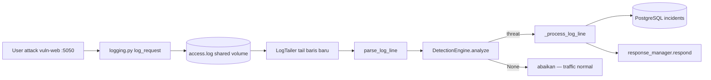

# PEMAHAMAN INCIDENTRA — HULU KE HILIR FILE BY FILE

> **Cara pakai file ini** (baca ini dulu):
> 1. Ikuti **Rencana 10 hari** di bawah — jangan baca 1025 baris sekaligus.
> 2. Setiap hari: baca 1 section MD → buka file di tabel "Files terlibat" → Ctrl+F anchor → cocokkan baris MD dengan baris kode.
> 3. Centang checklist hari itu kalau sudah bisa jelaskan dengan mulut (bukan hafalan).
> 4. **Section 16 + Appendix** = referensi lengkap Redis, Celery, sync/thread — baca HARI 8–9.
> 5. Section 15 (cheat sheet) = baca ulang HARI 10 sebelum sidang.
>
> **Target 10 hari:** bukan hafal semua baris — tapi **bisa jelaskan alur + tunjuk lokasi kode** untuk setiap bagian app.

---

## Rencana baca 10 hari (urutan wajib)

| Hari | Section MD | File kode utama | Target harian (bisa dijelaskan?) |
|------|------------|-----------------|----------------------------------|
| **1** | 16 (Sync/Thread/Celery) + base boot §11 | `App.js`, `api.js` | Beda sync vs thread vs Celery worker |
| **2** | 1 Login | `auth.py`, `Login.js` | JWT, register pending, rate limit register |
| **3** | 3 vuln-web + log_parser | `logging.py`, `log_parser.py` | POST_DATA, parse Langkah A–D |
| **4** | 3 log_monitor | `log_monitor.py` | `_process_log_line` 14 langkah |
| **5** | 3 analyze + 4 respond | `detection_engine.py`, `response_manager.py` | Regex + BF + escalating block |
| **6** | 2 Dashboard + Appendix globe + **Appendix G** Dashboard hooks | `Dashboard.js` | useState + useEffect polling |
| **7** | 5 AI + 14 Chatbot | `ai_service.py`, `incidents.py`, `chatbot.py` | Groq fallback, bukan deteksi |
| **8** | 6 IP + 7 Rules + Appendix Redis | `blocked_ips.py`, `rules.py` | Semua Redis key + RBAC |
| **9** | 8 Notif + 10 Docker + Appendix Celery | `celery_worker.py`, `docker-compose.yml` | Cleanup hourly, 6 service |
| **10** | 9 Settings/RBAC + 12–14 UI + **15 cheat sheet** | `Settings.js`, `Incidents.js` | Demo full + jawaban sidang |

**Backend dulu (hari 3–5), frontend (hari 6–7, 10).** Hari 1 = konsep dasar supaya "sync/thread" tidak bingung lagi.

---

**Status pengerjaan** — centang per hari (ikuti rencana 10 hari):

| Hari | Topic | [ ] |
|------|-------|-----|
| 1 | §16 Sync/Thread/Celery + §11 boot | |
| 2 | §1 Login | |
| 3 | §3 vuln-web + log_parser | |
| 4 | §3 log_monitor | |
| 5 | §3 analyze + §4 respond | |
| 6 | §2 Dashboard + globe | |
| 7 | §5 AI + §14 chatbot | |
| 8 | §6–7 IP/Rules + App Redis | |
| 9 | §8–10 Notif/Docker + App Celery | |
| 10 | §9 RBAC + §12–15 sidang | |

**Urutan isi dokumen:** §16 (konsep) → §3–10 backend → §1–2 & §11–15 frontend → **Appendix A–F** (referensi 100%).

---

## Pemahaman base utama (boot frontend) — ringkas; detail di Section 11

1. Browser muat `frontend/public/index.html` → `<div id="root">`.
2. `frontend/src/index.js` → `ReactDOM.createRoot(...).render(<App />)`.
3. `App.js` → `LanguageProvider` → `ThemeProvider` → `Router` → auth gate.
4. Belum login → `/login`; sudah login → `Layout` + nested routes + `ChatbotWidget`.
5. Semua API lewat `frontend/src/services/api.js` (axios + JWT interceptor).

## 1. Login & Self-Registration

**Files terlibat:**

| Layer | File | Ctrl+F anchor |
|---|---|---|
| Frontend | `frontend/public/index.html` | `#root` |
| Frontend | `frontend/src/index.js` | `createRoot`, `<App />` |
| Frontend | `frontend/src/App.js` | `handleLogin`, `isAuthenticated`, `Navigate` |
| Frontend | `frontend/src/pages/Login.js` | `Ctrl+F` (baris 1) → `handleLogin`, `handleRegister` |
| Frontend | `frontend/src/services/api.js` | `login`, `register` |
| Backend | `backend/app/api/auth.py` | `Ctrl+F` (baris 1) → `login`, `register`, `_make_token`, `_register_rate_limited` |
| Backend | `backend/app/api/auth_middleware.py` | `verify_token` |
| Backend | `backend/app/models/__init__.py` | `class User` |

**Alur (isi sendiri sambil klik-klik):**

 
1. klik login menggunakan admin credentials yang sudah di seed, berhasil masuk
2. klik login menggunakan username yang tidak terdaftar, tidak berhasil masuk 
3. register harus menggunakan 2 persyaratan password, sama dengan confirmation field & 8 char length
4. saat berhasil registrasi harus approval admin terlebih dahulu.


**Pemahaman saya:**

1. Login memanggil function handleLogin untuk mengirim request `POST` login ke backend melalui `api.js`, Register melakukan hal yang mirip dengan login, yaitu melalu perantara file `api.js` dia mengirim request ke backend untuk registrasi menggunakan function handleRegister.
2. File `api.js` menggunakan library axios untuk melakukan proses request atau pemanggilan ke backend url yang bisa diset file ENV Frontend dengan fallback URL yang bisa di set di file api.js langsung.
3. Endpoint restAPI yang berupa URL prefix sebagai blueprint yang berasal dari `backend/app/__init__.py` file tersebut mengimport setiap file blueprint di dalam folder `backend/app/api` lalu melakukan `register_blueprint`, tidak semua file di dalam `backend/app/api` adalah blueprint, ada sebagian cuma helper.
4. route `/login` berasal dari file `auth.py` yaitu `@auth_bp.route('/login', methods=['POST'])` lalu frontend mengirim POST request dengan payload json username dan password melalui `api.js`.
5. route `/register` persis dengan route `/login`, dari `@auth_bp.route('/register', methods=['POST'])` dan frontend memanggilnya melalui `api.js` untuk mengirim POST request daftar payload username, email, & password (confirmPassword hanya divalidasi di frontend). Setelah berhasil daftar user otomatis `status=pending`, `role=None` — terdaftar di database sebelum admin assign role di User Management.
6. Terdapat perlindungan anti spam register: `_register_rate_limited()` di Redis (max 5/jam per IP) — **beda** dari rate limit IP attack di vuln-web (Redis + `rate_limited.json`).
7. File blueprint `auth.py` untuk logic login/register. Selain `/login` dan `/register`, ada `GET /users` (`list_users`) — dipakai `IncidentDetail.js` untuk dropdown assign incident (bukan halaman User Management; itu `GET /api/users/` di `users.py`).
8. Setelah POST login, backend `auth.py` cocokkan username + `check_password_hash` via SQLAlchemy. Jika OK, `_make_token()` generate JWT → response `{ token, user }` → `Login.js` panggil `onLogin(res.data.token)`.
9. `App.js` `handleLogin(token)` simpan ke `localStorage` (`incidentra_token`), set `isAuthenticated=true` → React Router `<Navigate to="/" />` → Dashboard.

kesimpulan:

1. User submit form → handleLogin / handleRegister di Login.js
2. Panggil login() / register() di api.js (axios)
3. Request ke http://localhost:5000/api + path (ENV atau fallback)
4. Flask: blueprint prefix /api/auth (__init__.py) + route /login (auth.py) = /api/auth/login
5. Backend proses → balikin JSON → frontend simpan token / tampilkan pesan

Frontend React memanggil backend Flask lewat axios di api.js. Base URL di-set via environment variable dengan fallback localhost:5000/api. Backend memakai Flask Blueprint — prefix /api/auth diregister di app factory, route /login didefinisikan di auth.py, sehingga endpoint penuh menjadi POST /api/auth/login.

**Pertanyaan saya:**

- Q1. Apakah sudah cukup aman secara keamanan? mengingat web SOC adalah web keamanan pasti akan ditanyai mengenai hal ini, implementasi keamanan web SOC itu sendiri.

**Jawaban:**

- **A1.** Cukup untuk capstone SME dengan catatan berikut:
  - **Password:** disimpan sebagai hash scrypt (Werkzeug `generate_password_hash` / `check_password_hash`), tidak plain text di DB.
  - **Login:** error unified `invalid_credentials` (username salah = password salah) — anti user enumeration.
  - **JWT:** HS256, signed `SECRET_KEY`, expire 24 jam; setiap API call diverifikasi `verify_token()` dari helper `backend/app/api/auth_middleware.py` + cek status user live di DB (pending/suspended ditolak meski token masih ada).
  - **Register:** rate limit Redis 5/jam per IP; password min 8 char; akun pending sampai admin approve + assign role.
  - **Transport:** production wajib HTTPS — payload login terlihat di DevTools browser user sendiri (normal), bukan celah remote.
  - **Keterbatasan scope:** belum 2FA, belum refresh-token rotation — acceptable untuk capstone; bisa disebut sebagai future work di sidang.

---

## 2. Dashboard (KPI cards, charts, globe)

**Files terlibat:**

| Layer | File | Ctrl+F anchor |
|---|---|---|
| Frontend | `frontend/src/App.js` | `Dashboard`, `isAuthenticated`, route `/` |
| Frontend | `frontend/src/pages/Dashboard.js` | `fetchStats`, `CHART 1`, `checkLogStatus` |
| Frontend | `frontend/src/services/api.js` | `getDashboardStats`, `getLogStatus` |
| Frontend | `frontend/src/components/dashboard/AttackOriginsGlobe.js` | *(globe — data `top_countries`)* |
| Backend | `backend/app/api/dashboard.py` | `get_stats`, `log_status`, `timeline_raw` |

**Library yang dipakai di Dashboard.js:**

| Library | Fungsi |
|---|---|
| `@mui/material` + `@mui/icons-material` | Layout, Card, Grid, Chip, CircularProgress, dll. |
| `react-chartjs-2` (`Line`, `Doughnut`, `Bar`) | Wrapper React untuk Chart.js |
| `chart.js` | Engine chart (register scale/element di baris register) |
| `react-globe.gl` (via `AttackOriginsGlobe.js`) | Globe 3D attack origins — lazy load |

**Pemetaan section UI → data backend:**

| Section di layar | Field JSON dari `GET /api/dashboard/stats` | Chart / komponen |
|---|---|---|
| Header + refresh | `lastRefresh` (frontend only) | — |
| Warning kuning "No logs in 60s" | `GET /api/dashboard/log-status` → `{ stale: true }` | — |
| System Status banner | `system_status` | `SystemStatusBanner` |
| Total Incidents | `total_incidents` | `StatCard` |
| Last 24 Hours | `last_24h` | `StatCard` |
| Blocked IPs | `blocked_ips` | `StatCard` |
| MTTR | `mttr_minutes` | `StatCard` |
| Incident Timeline (7 days) | `timeline[]` → `{ date, count }` | **CHART 1** — `Line` (`timelineData`) |
| By Severity | `severity_breakdown[]` | **CHART 2** — `Doughnut` (`severityData`) |
| Severity Trend (7 days) | `severity_timeline[]` | **CHART 3** — `Line` multi-series (`severityTrendData`) |
| Attack Origins globe | `top_countries`, `geo_enriched_7d`, `last_7d` | **Globe** — `AttackOriginsGlobe` |
| Attack Types | `attack_breakdown[]` | **CHART 5** — `Bar` (`attackData`) |
| Top Attacking IPs | `top_attacking_ips[]` | list + `LinearProgress` (bukan Chart.js) |

**Alur:**

1. Setelah login, React Router arahkan ke `/` → render `Dashboard.js`
2. `useEffect` panggil `fetchStats()` + `checkLogStatus()` sekali saat mount
3. `fetchStats` → `getDashboardStats()` di `api.js` → `GET http://localhost:5000/api/dashboard/stats` (JWT di header dari interceptor)
4. Backend `dashboard.py` `get_stats()` query PostgreSQL (`incidents`, `blocked_ips`) → return JSON agregat
5. Frontend simpan ke `stats` state → siapkan `timelineData`, `severityData`, dll. → render chart
6. Auto-refresh: stats tiap 15s (`REFRESH_INTERVAL`), log-status tiap 30s
7. Tombol refresh manual memanggil `fetchStats()` lagi

**Pemahaman saya:**

1. Setelah login sukses, route diarahkan ke `/` → render `Dashboard.js`. Di DevTools Network: request `login` (dapat token) lalu `stats` (dengan header `Authorization: Bearer ...`).
2. Saat pertama buka Dashboard (**mount**), `useEffect` jalankan `fetchStats()` + `checkLogStatus()` → data tampil.
3. `fetchStats()` → `getDashboardStats()` di `api.js` → `GET /api/dashboard/stats` → `dashboard.py` `get_stats()`.
4. Response JSON → `setStats(res.data)`. `stats` dari `useState(null)` — setter-nya `setStats`.
5. `checkLogStatus()` poll tiap **30 detik**; backend anggap stale jika tidak ada log **60 detik** (`stale: true` → banner kuning).
6. Angka 0 di UI = DB belum ada incident — bukan error frontend.

**CHART 1 — Incident Timeline (7 Days)** — sudah dipahami hulu→hilir:

- `fetchStats()` → `get_stats()` → query `timeline_raw` (COUNT incident GROUP BY date, 7 hari)
- `_fill_timeline()` isi hari tanpa incident dengan `count: 0`
- JSON field `timeline` → frontend `setStats(res.data)`
- Pisah jadi `timelineCounts` (sumbu Y) + `timelineLabels` (sumbu X, `formatChartDay`)
- Gabung `timelineData` format Chart.js → `<Line data={timelineData} />` (kiri atas, garis cyan)

**CHART 2 — By Severity (Doughnut)** — kanan atas:

- Backend `get_stats()` query `GROUP BY severity` → `severity_breakdown[]` `{ severity, count }`.
- Frontend `Dashboard.js`: map ke labels (`Critical`, `High`, …) + `severityData` Chart.js Doughnut.
- Warna dari konstanta severity theme (merah/oranye/kuning/hijau).

**CHART 3 — Severity Trend (7 Days)** — multi-line:

- Backend `severity_timeline_raw` = COUNT per `(date, severity)` 7 hari → `_fill_severity_timeline()` isi hari+severity yang count=0.
- Frontend: 4 series Line (critical/high/medium/low) share label tanggal dari `timeline`.

**CHART 5 — Attack Types (horizontal Bar)** — kanan bawah:

- Backend `attack_breakdown[]` `{ type, count }` dari `GROUP BY attack_type`.
- Frontend `attackData` Bar horizontal — label = attack type enum.

**Globe — Attack Origins:**

- **Bukan API terpisah** — data dari field yang sama `GET /dashboard/stats`.
- Backend: query `Incident.country_code` 7 hari terakhir (non-null) → `top_countries[]` `{ code, count }` + `geo_enriched_7d` + `last_7d`.
- `country_code` diisi **background thread AbuseIPDB** di `log_monitor` (Section 3/8) — bukan AI Groq.
- Frontend `AttackOriginsGlobe.js`: `buildPoints(countries)` → lookup lat/lng static `data/countryCentroids.js` → `react-globe.gl` titik cyan. Side panel top 8 + flag emoji.
- Empty state: ada incident 7 hari tapi `geo_enriched_7d=0` → hint set AbuseIPDB API key.

**Top Attacking IPs** — list + `LinearProgress`:

- Backend `top_attacking_ips[]` `{ ip, count }` limit 10.
- Klik IP → buka `IPHistoryDrawer` (`GET /ip/:ip/history`).

**System Status banner:**

- Backend `_get_system_status()`: ada incident NEW critical → merah; NEW high → kuning; else hijau.

**MTTR card:**

- Rata-rata menit `(resolved_at - created_at)` untuk incident status RESOLVED; kalau belum ada resolved → 0.

**Pertanyaan saya:**

- Q1. Globe pakai API maps? → **Tidak.** Koordinat static per country code; data count dari PostgreSQL.

**Jawaban:**

- A1. Globe = visualisasi `top_countries` dari stats; geo dari AbuseIPDB enrichment ke kolom `incidents.country_code`.

---

## 3. Log Ingestion → Detection

> **Status:** vuln-web ✅ | log_parser ✅ | log_monitor ✅ | **`analyze()` ✅** | **`respond()` → Section 4**

**Files terlibat:**

| Layer | File | Ctrl+F anchor | Peran singkat |
|---|---|---|---|
| Target app | `vuln-web/middleware/logging.py` | `log_request`, `POST_DATA` | Tulis baris log (NCSA + body POST) ke file atau push HTTP |
| Docker | `docker-compose.yml` | `vuln_logs`, `WEB_SERVER_LOG_PATH` | Volume shared: vuln-web tulis, backend tail |
| Backend startup | `backend/docker_entrypoint.sh` | `docker_log_monitor.py` | Monitor jalan terpisah dari Gunicorn (Docker) |
| Backend startup | `backend/run.py` | `start_monitor` | Monitor jalan saat `python run.py` (dev manual) |
| Backend | `backend/docker_log_monitor.py` | `start_monitor` | Process standalone tail log di container |
| Backend | `backend/app/core/log_parser.py` | `parse_log_line`, `LogTailer`, `POST_DATA_PATTERN` | String log → dict `{ ip, method, path, query, ... }` |
| Backend | `backend/app/core/log_monitor.py` | `_process_log_line`, `ingest_log_lines`, `start_monitor` | Orkestrator: parse → detect → incident → response |
| Backend | `backend/app/core/detection_engine.py` | `DETECTION_PATTERNS`, `analyze`, `BruteForceTracker` | Regex + threshold → threat dict atau `None` |
| Backend | `backend/app/models/__init__.py` | `class Incident`, `class DetectionRule` | Row incident + rule match_count |
| Backend (opsional) | `backend/app/api/internal.py` | `ingest_logs` | Hanya deployment terpisah (Railway); Docker pakai shared file |
| Backend (opsional) | `backend/app/api/detection.py` | `inject` | Manual inject log untuk testing |

**Diagram alur (hulu → hilir):**



> **Status Section 3:** vuln-web ✅ | log_parser ✅ | log_monitor ✅ | `analyze()` ✅ | Section 4 `respond()` ✅ (lihat Section 4)

**Alur langkah demi langkah:**

1. [x] Attacker kirim request ke vuln-web (contoh SQLi di query/form)
2. [x] `logging.py` `log_request()` — setelah response, format baris NCSA Combined Log
3. [x] Kalau POST: append `POST_DATA:key=val&...` supaya detection bisa baca body (bukan cuma URL)
4. [x] Docker: tulis ke `/app/logs/access.log` (vuln-web) = `/app/watched_logs/access.log` (backend) via volume `vuln_logs`
5. [x] `docker_log_monitor.py` → `start_monitor()` → `LogTailer` poll file tiap ~1 detik
6. [x] Baris baru → `_process_log_line(line, ...)`
7. [x] `parse_log_line()` — regex `NGINX_PATTERN` + strip/merge `POST_DATA` ke field `query` (Langkah A–D)
8. [ ] `DetectionEngine.analyze(entry)` — gabung string `method path query user_agent`, match regex DB + baseline OWASP
9. [ ] Kalau match → threat dict; kalau tidak → return `None`, selesai
10. [x] Dedup: skip jika IP+attack_type sama sudah ada incident dalam **5 menit** (kecuali waiver unblock)
11. [x] Buat row `Incident` di PostgreSQL, commit, `rule.match_count++` kalau rule DB aktif
12. [~] `responder.respond(threat, incident.id)` → **Section 4** (tahu dipanggil; detail block belum)
13. [x] Background thread AbuseIPDB (kalau API key ada) — **bukan** AI; lihat sub-bagian di bawah
14. [~] Dashboard `/stats` baca tabel `incidents` → angka/chart berubah (konsep OK; latihan hands-on belum semua)

**Mode log monitor (env):**

| Env | Perilaku |
|---|---|
| Docker Compose | `USE_SIMULATED_LOGS=false` → tail **access.log nyata** dari vuln-web |
| Dev `run.py` | Sama — `start_monitor` di `__main__` |
| `USE_SIMULATED_LOGS=true` | `SimulatedLogFeeder` — demo tanpa vuln-web (jarang dipakai production) |

**Isi `parse_log_line` output (hafal keys ini):**

| Key | Dari mana |
|---|---|
| `ip` | Client IP di baris log |
| `method` | GET / POST / … |
| `path` | Path URL (decoded) |
| `query` | Query string + **POST_DATA** digabung |
| `user_agent` | UA string |
| `status_code` | HTTP status response |
| `raw` | Baris log asli (truncated di incident) |

**Isi `analyze()` — urutan logic:**

1. Skip kalau IP di **whitelist** (`BlockedIP.is_whitelist=True`)
2. Reload rules dari DB kalau `rules_dirty` (Redis) — Section 7
3. Loop compiled regex per `attack_type` (SQL_INJECTION, XSS, PATH_TRAVERSAL, …)
4. Brute force: POST ke path login + threshold Redis (`BruteForceTracker`) — bukan regex
5. Kalau banyak match → ambil **severity tertinggi** (`score`)
6. Return threat dict atau `None`

**Attack types baseline (hardcoded di `DETECTION_PATTERNS`):**

| Type | Cara detect | Severity default |
|---|---|---|
| SQL_INJECTION | Regex di query/path/POST_DATA | critical |
| XSS | Regex tag/script/event handler | critical |
| PATH_TRAVERSAL | `../`, `/etc/passwd`, dll. | high |
| COMMAND_INJECTION | `;whoami`, `cmd=`, dll. | critical |
| FILE_UPLOAD | ekstensi berbahaya di POST_DATA | high |
| SCANNER | UA/tool scanner | medium |
| BRUTE_FORCE | threshold POST login | high |

**Shared volume (Docker) — bukan 1 service barengan:**

```
vuln_web container          backend container
/app/logs/access.log   ←→   /app/watched_logs/access.log
         └──── volume vuln_logs (disk shared) ────┘
```

6 service = 6 container terpisah. Volume = folder disk yang di-mount ke 2+ container (path di dalam container boleh beda, file sama).

**Pemahaman saya — vuln-web (selesai):**

1. `app.py` membuat Flask app vuln-web. Tidak berisi route handler — handler ada di `routes/*.py`, didaftarkan lewat `register_blueprints(app)` dari `routes/__init__.py`.
2. Setiap HTTP request: `@app.before_request` → `enforce_security()` (cek block/rate-limit); route handler di `routes/*.py`; `@app.after_request` → `log_request(response)`.
3. `enforce_security()` (`security.py`) baca blocklist dari JSON file (`blocked_ips.json`, `rate_limited.json`) yang **ditulis backend** ke shared volume. Match IP → 403/429. Railway terpisah: `_fetch_blocklist_remote()` GET ke `/api/internal/blocklist`.
4. `get_client_ip(request)` dari **`vuln-web/ip_utils.py`** (bukan backend). Prioritas: `X-Real-IP` → `X-Forwarded-For` (IP pertama) → `remote_addr` (Docker lokal).
5. `log_request(response)` (`logging.py`): **`request`** (Flask global) untuk method, path, form POST → `POST_DATA:`; **`response`** (parameter dari after_request) untuk status code & content length — POST_DATA bukan dari response object.
6. Langkah logging: kumpulkan POST body → (opsional) `g.log_extra` → susun baris NCSA → append ke `access.log` (Docker/manual) atau push `LOG_INGEST_URL` (Railway).
7. GET attack payload ada di URL (query string), sudah tercatat di log tanpa `POST_DATA`. POST attack sering butuh suffix `POST_DATA:`.

**Pemahaman saya — backend (`log_parser.py`):**

**Kondisi sebelum file ini berjalan:**
`logging.py` menyimpan isi body request ke suffix `POST_DATA:` karena Nginx access log standar TIDAK menyertakan body. Setelah itu disusun menjadi format NCSA yang disimpan ke shared volume `vuln_logs` (Docker) atau di-push lewat `LOG_INGEST_URL` (Railway).

#### `LogTailer` — baca file real-time (dipakai di `start_monitor` → `feeder.tail()`)

1. `LogTailer()` berfungsi untuk membaca file log secara real-time; outputnya berupa 1 baris log (string) per yield — input untuk `parse_log_line()`.
2. `_get_inode(self)` mengecek apakah file masih file yang sama di disk, dengan cara cek unique ID (`st_ino`) pada filesystem — berguna kalau log di-rotate (file diganti).
3. `tail(self)` generator: yield 1 baris log satu per satu ke loop `for line in feeder.tail()` di `_run()`.
4. `f.seek(0, 2)` loncat ke akhir file (EOF) saat startup — skip log lama; hanya proses baris **baru** setelah backend restart.
5. `self._pos` = bookmark byte — posisi terakhir sudah dibaca; supaya tidak baca ulang baris yang sama.
6. Loop `while True` (background thread): bila file diganti (rotation) atau di-truncate (dikosongkan) → reset `self._pos = 0`.
7. Alur baca: `f.seek(self._pos)` → `readlines()` ambil baris baru saja → update `_pos` → `yield line` → `_process_log_line(line)` di `log_monitor.py`.
8. `time.sleep(self.poll_interval)` tunggu 1 detik sebelum cek lagi — hemat CPU (bukan busy-wait terus).

**Referensi cepat (tabel — suplemen, bukan pengganti poin di atas):**

| # | Bagian | Fungsi singkat |
|---|---|---|
| 1 | `__init__` | Path file + poll interval |
| 2 | `_get_inode()` | Deteksi log rotation |
| 3–8 | `tail()` | Loop baca baris baru → yield |

> **Catatan:** `SimulatedLogFeeder` (class lain di file yang sama) hanya dipakai kalau `USE_SIMULATED_LOGS=true` — data hardcoded, bukan tail file nyata.

#### `parse_log_line(line)` — string → dict

1. `parse_log_line()` mengambil 1 baris log string, memisahkan suffix `POST_DATA`, menyisakan baris NCSA murni (tanpa suffix).
2. Pemisahan pakai regex `POST_DATA_PATTERN` (suffix body) dan `NGINX_PATTERN` (baris NCSA standar).
3. Data dipecah path vs query string URL (untuk GET attack): library `urllib` (`urlparse`, `unquote_plus`) memecah `/search?q=%3Cscript%3E` → `path='/search'`, `query='q=%3Cscript%3E'` lalu decode `%3C → <`, `%3E → >`, `%20`/`+` → spasi.
4. **Langkah D (POST):** URL sering tidak punya `?` → setelah Langkah C `query` kosong; isi body dari `post_data` (hasil potong `POST_DATA:`) digabung ke `query` → detection engine scan field `query`.
5. Return dict `{ ip, method, path, query, user_agent, status_code, raw }` — parser **tidak** deteksi serangan; hanya string → dict.

**Langkah A–D (ringkas):**

| Langkah | Apa | Contoh |
|---|---|---|
| A | Potong suffix `POST_DATA:...` | `post_data` = isi body form |
| B | Regex NCSA → ip, method, path, status, ua | `"POST /login HTTP/1.1"` |
| C | `urlparse` + `unquote_plus` (GET) | `%3Cscript%3E` → `<script>` |
| D | `query += post_data` (POST) | `query = username=hello&password=` |

**Contoh GET XSS:** `full_path='/search?q=%3Cscript%3E...'` → setelah C: `path='/search'`, `query='q=<script>...'`

**Contoh POST login (Burp):** `full_path='/login'` → C: `query=''` → D: `query='username=hello&password='`

**Catatan baris 51 — `' ' + m.group(1)` (spasi di dalam petik memang sengaja):**

- Regex `POST_DATA_PATTERN` hanya menangkap isi **setelah** teks `POST_DATA:` → `group(1)` = `username=hello&password=` (tanpa spasi di depan).
- Di log asli ada spasi **sebelum** kata `POST_DATA:` (antara `"Mozilla..."` dan `POST_DATA:`).
- `' '` = string Python berisi **1 karakter spasi** — ditambah di depan isi body supaya saat digabung ke `query` ada pemisah kalau URL sudah punya query string.
- Baris `.strip()` buang spasi ujung — kalau `query` kosong, hasil akhir tetap `username=hello&password=` (tanpa spasi depan).

**Hubungan logging.py ↔ log_parser.py (tidak saling import):**

```
logging.py:  request.form → string ' POST_DATA:username=hello&password=' → access.log
log_parser.py: baca string → POST_DATA_PATTERN + NGINX_PATTERN → dict entry
```

---

**Pemahaman saya — backend (`log_monitor.py`):**

#### `start_monitor()` & `_run()` — background thread

1. `start_monitor()` dipanggil saat startup backend — dari `backend/run.py` (dev manual) atau `backend/docker_log_monitor.py` (Docker/Railway, proses terpisah dari Gunicorn).
2. Variable module-level (`_monitor_thread`, `_running`, `last_log_received_at`) diubah pakai `global` supaya `stop_monitor()` bisa hentikan loop dari luar — bukan variable lokal function saja.
3. `touch_last_log_received(redis_client)` mencatat waktu log terakhir diterima — di memori proses ini + (kalau ada) Redis key `log_monitor:last_received_at` untuk Dashboard banner stale.
4. `_run()` adalah **inner function** — body thread background. Tanpa ini, loop `feeder.tail()` akan block `start_monitor()` dan Flask/Gunicorn tidak bisa lanjut serve API.
5. `_run()` import lazy: `LogTailer` / `SimulatedLogFeeder` dari `log_parser.py`, `DetectionEngine` dari `detection_engine.py`, `ResponseManager` dari `response_manager.py`.
6. Helper `resolve_web_log_path()` baca lokasi file log dari ENV `WEB_SERVER_LOG_PATH` (Docker: `/app/watched_logs/access.log`).
7. `feeder = LogTailer(log_path)` — yield 1 baris log dari `access.log` (lihat pemahaman LogTailer di atas).
8. `engine = DetectionEngine(redis_client=redis_client)` + `register_detection_engine(engine)` + `responder = ResponseManager(db=db, redis_client=redis_client, app=app)` dibuat **sekali** sebelum loop — tidak dibuat ulang per baris (hemat resource).
9. Method crucial: `engine.analyze(entry)` → threat dict; `responder.respond(threat, incident.id)` → block/rate-limit.
10. `with app.app_context():` — method bawaan Flask pada object `app` dari `create_app()` (`backend/app/__init__.py`). SQLAlchemy query butuh Flask context di background thread.
11. Loop `for line in feeder.tail():` — `line` = string 1 baris log. Jika global `_running` di-set `False` (`stop_monitor()`), break keluar loop. Loop tidak selesai sendiri kecuali backend stop.
12. Tiap iterasi: `_process_log_line(line, engine, responder, db, redis_client, app)`.
13. `_monitor_thread = threading.Thread(target=_run, daemon=True, name='LogMonitor')` — `target=_run` = function yang dijalankan thread; `daemon=True` = mati otomatis kalau proses utama mati; `.start()` = baru di sini `_run()` mulai jalan (non-blocking).
14. `start_monitor()` langsung return setelah `.start()` — **tidak** tunggu loop selesai.

#### `_process_log_line()` — Parse → detect → dedup → incident → respond

1. Proses lengkap terbuatnya incident dan response: `Parse → detect → dedup → incident → respond`.
2. Import lazy: `parse_log_line()` dari `log_parser.py`; model PostgreSQL dari `app.models` (`Incident`, `DetectionRule`, enum severity/status).
3. `touch_last_log_received(redis_client)` — catat "log terakhir diproses jam berapa". Dashboard baca via `get_last_log_received_at()` → banner kuning kalau stale >60s.
4. `entry = parse_log_line(line)` — string → dict. `threat = engine.analyze(entry)` — dict → threat dict atau `None` (bukan threat → selesai, tidak INSERT). **Detail `analyze()` → tabel line-by-line di bawah (detection_engine).**
5. **Dedup:** `skip_dedup = False` default (dedup **aktif**). Kalau `not skip_dedup`: query **SELECT** PostgreSQL — incident dengan IP + `attack_type` sama dalam 5 menit? Jika **sudah ada** → `return None` (**dedup skip**, bukan INSERT). Jika **belum ada** → lanjut INSERT. `skip_dedup = True` hanya setelah admin unblock IP (waiver Redis 1×, 10 menit) — untuk testing/demo.
6. **Severity:** `sev_map` = jembatan string dari `analyze()` (mis. `'high'`) → enum SQLAlchemy `SeverityLevel.HIGH` untuk kolom DB. Default fallback: `MEDIUM`.
7. **Detection rule:** `DetectionRule.query.filter_by(attack_type=..., is_active=True).first()`. Jika ketemu → isi `rule_id` + `match_count += 1`. **Jika tidak ketemu → `rule_id = None`, incident tetap dibuat** (match dari baseline OWASP di engine, bukan rule DB). *(Koreksi: bukan `return None`.)*
8. Buat object `incident = Incident(...)` — isi dari `threat` dict: `source_ip`, `attack_type`, `severity`, `status=IncidentStatus.NEW`, `raw_payload`, `request_path`, `request_method`, `user_agent`, `response_code`, `rule_id`.
9. `db.session.add(incident)` lalu `db.session.commit()` — **INSERT** ke PostgreSQL. Setelah commit, `incident.id` ada → KPI Dashboard bisa naik.
10. `logger.info(f"[THREAT] ...")` — log backend untuk debugging (`docker compose logs backend`).
11. `responder.respond(threat, incident.id)` — panggil block / rate-limit dari `response_manager.py` → **Section 4**.
12. Urutan sengaja: buat incident **dulu**, baru block — supaya tiket tetap ada di SOC meskipun blocking gagal.
13. **AbuseIPDB (opsional, baris 196–214):** jika `_get_setting('ABUSEIPDB_API_KEY')` diset → buat inner function `_rep_thread()`, jalankan di `threading.Thread` baru. Lihat sub-bagian di bawah.
14. `return incident.id` — ID incident baru (dipakai `ingest_log_lines()` untuk kumpulkan list; loop monitor tidak pakai return value).

#### AbuseIPDB + `threading.Thread` (baris 196–214)

**Pemahaman saya:**

1. Ini **bukan** core pipeline — kalau API key kosong, seluruh blok di-skip, langsung `return incident.id`. Deteksi + incident + block tetap jalan.
2. **Thread** = pekerjaan paralel dalam 1 program Python (bukan proses baru, bukan Celery). Supaya HTTP ke AbuseIPDB (~1–10 detik) **tidak menghambat** loop baca log berikutnya.
3. **Bukan Celery `.delay()`** — tidak masuk antrian Redis. Pola sama dengan notifikasi email di `response_manager._notify_async()`. Celery di project ini cuma cleanup block hourly.
4. Inner function `_rep_thread(app_ref, inc_id, ip)` — body yang dijalankan thread.
5. `with app_ref.app_context():` — thread baru tidak punya Flask context bawaan; SQLAlchemy butuh ini untuk `Incident.query.get()` + `commit()` di `_do_reputation_check`.
6. `_do_reputation_check(inc_id, ip)` di `app/services/threat_intel_service.py` — GET AbuseIPDB → update field `country_code` dan `abuse_confidence_score` pada row incident **yang sudah ada** (bukan buat incident baru).
7. `threading.Thread(target=_rep_thread, args=(app, incident.id, threat['ip']), daemon=True).start()`:
   - `target` = function yang dijalankan
   - `args` = `app` dari parameter `start_monitor`, `incident.id` baru dari commit, IP dari `threat`
   - `daemon=True` = thread mati kalau proses utama restart
   - `.start()` = jalankan non-blocking — caller **tidak tunggu** selesai
8. Thread utama sudah `return incident.id` saat AbuseIPDB mungkin masih jalan — normal. Flag/country di UI bisa muncul beberapa detik kemudian setelah refresh.
9. **Beda AI Groq:** AbuseIPDB = reputasi IP otomatis (opsional). AI Explain = analyst klik manual di UI (Section 5).

**Diagram timing (suplemen visual — bukan pengganti poin di atas):**

```
Thread utama (_process_log_line)          Thread daemon (_rep_thread)
├─ commit incident ✅                      ├─ app.app_context()
├─ respond() block IP ✅                 ├─ _do_reputation_check()
├─ Thread(...).start()  ───────────────►└─ UPDATE country_code, abuse_score
└─ return incident.id  (tidak tunggu)
```

**Dedup — terminologi (suplemen):**

- `skip_dedup = False` → dedup aktif → 100× SQLi sama (IP + type, 5 menit) = **1 incident**
- `return None` di dedup = **dedup skip** (buang baris)
- Query dedup = **SELECT**, bukan INSERT

---

**Ringkas konsep backend (Section 3):**

1. Serangan tidak langsung masuk DB — harus lewat baris log dulu.
2. Backend tidak hook ke vuln-web — tail shared file atau terima push (`internal.py` Railway).
3. Satu baris log = parse → analyze → (optional) incident → respond.
4. Detection = regex + rule DB, **bukan** AI.
5. Dedup 5 menit = anti spam 100 ticket identik.


**Pemahaman saya — backend (`detection_engine.py`):**

#### Konstanta global (baris ~32–150)

1. `DETECTION_PATTERNS` — dict baseline OWASP: tiap attack type punya list regex + default severity + MITRE. `BRUTE_FORCE` sengaja `patterns: []` (threshold only).
2. `SEVERITY_WEIGHTS` — score numerik: critical=100, high=70, medium=40, low=10. Dipakai kalau satu log kena **beberapa** regex sekaligus → pilih yang score tertinggi.
3. `RESPONSE_ACTIONS` — jembatan ke Section 4: low→monitor, medium→rate_limit, high/critical→escalating_block.

#### `BruteForceTracker` (baris 158–206) — ringkas

1. Object counter POST login per `(ip, path)` dalam sliding window `self.window` detik (dari Settings `RATE_LIMIT_WINDOW`).
2. `record_attempt()` — Redis sorted set `bf:{ip}:{path}` atau fallback deque lokal.
3. `is_brute_force()` — True **hanya** saat count **tepat** == threshold (mis. attempt ke-10), bukan setiap attempt setelahnya.
4. `clear_ip()` — dipanggil saat admin unblock (reset counter).

#### `DetectionEngine` class (baris 230+)

1. `__init__` — buat `self.bf_tracker`, compile regex fallback OWASP (`self._compiled`).
2. `_refresh_runtime_settings()` — tiap `analyze()`: refresh window/threshold BF + cache lab mode.
3. `_maybe_reload_rules()` — reload rule DB kalau Redis key `rules_dirty` atau interval 60 detik lewat.
4. `_load_rules_from_db()` — merge rule analyst aktif + OWASP baseline (kecuali Lab mode = UI rules only).

#### `analyze(log_entry)` — line by line (baris 363–466)

| Baris | Apa yang terjadi |
|-------|------------------|
| 363–367 | Signature: input dict dari `parse_log_line`, output threat dict atau `None`. |
| 369–370 | Refresh settings + rules sebelum scan. |
| 372–380 | **Whitelist:** IP di `BlockedIP.is_whitelist=True` → `return None` (trusted IP). |
| 382–387 | Ambil `path`, `query`, `user_agent`, `method`, `status_code` dari entry. |
| 389–390 | `searchable = "{method} {path} {query} {user_agent}"` — string untuk regex. |
| 392–393 | `threats = []`; `compiled = self._get_compiled()` — rules siap scan. |
| 396–417 | **Loop regex:** per attack_type, `pattern.search(searchable)`. Match → append ke `threats` dengan severity, mitre, matched_text, score. Satu type cukup 1 match (`break`). |
| 419–432 | **Brute force:** POST + path login + status 200/401/403 + BF enabled → `bf_tracker.is_brute_force()` → append BRUTE_FORCE. |
| 434–444 | **Edge case:** PATH_TRAVERSAL + LFI_RFI keduanya match tapi tidak ada `php://`/URL remote → buang LFI_RFI. |
| 447–448 | `threats` kosong → `return None` (traffic normal). |
| 451 | `primary = max(threats, key=score)` — pilih severity tertinggi. |
| 453–466 | Return dict final: metadata request + `matched_text` + **`recommended_action`** dari `RESPONSE_ACTIONS` → dipakai `respond()`. |

**Catatan sidang:**

- Deteksi regex **tidak** peduli web vulnerable atau status HTTP (404 tetap kena SQLi di URL).
- Brute force **peduli** status (hanya 200/401/403).
- Detection = signature/rule, **bukan** AI Groq.

**Latihan (~1–2 jam):**

1. [x] `docker compose up` — buka vuln-web `:5050`, kirim SQLi (`' OR 1=1--`)
2. [ ] `docker compose logs backend` — cari `[THREAT] SQL_INJECTION from ...`
3. [ ] Buka Incidentra UI → Incidents — row baru muncul?
4. [ ] Dashboard → angka `last_24h` naik?
5. [x] Tail log volume — lihat format `POST_DATA:` (`docker compose exec vuln_web tail access.log`)
6. [ ] Trace 1 baris: copy log line → `parse_log_line` → `analyze`

**Pertanyaan sidang (draft — centang kalau sudah bisa jawab):**

- [x] Q1. Kenapa perlu `POST_DATA` di log, tidak cukup URL saja?
- [x] Q2. Beda detection engine vs AI Groq?
- [x] Q3. Apa yang terjadi kalau log monitor mati? (hint: banner kuning Dashboard `/log-status`)
- [x] Q4. Bagaimana Docker Compose hubungkan vuln-web log ke backend?
- [x] Q5. Kenapa ada dedup 5 menit?
- [x] Q6. Kenapa AbuseIPDB pakai `threading.Thread`, bukan Celery `.delay()`?

**Jawaban:**

- **A1.** Banyak attack (SQLi login, upload shell) ada di **body POST**, bukan URL. Tanpa `POST_DATA`, log cuma path `/login` — detection tidak lihat payload. GET attack tetap terdeteksi dari query string di URL log.
- **A2.** Detection engine = regex/rule di `detection_engine.py`, jalan otomatis per baris log. AI Groq = explain incident **manual** on-demand (`POST /api/incidents/{id}/explain`), bukan deteksi.
- **A3.** Log monitor idle >60s → `GET /log-status` return `stale: true` → banner kuning di Dashboard. Pipeline ingestion mati; incident baru tidak terbuat.
- **A4.** Volume `vuln_logs` di-mount ke vuln-web (`/app/logs`) dan backend (`/app/watched_logs`) — file `access.log` sama. Backend `LogTailer` tail file itu.
- **A5.** Tanpa dedup, 1 attacker kirim 100 request SQLi = 100 incident identik. Dedup 5 menit (IP + attack_type sama) = 1 incident per window.
- **A6.** AbuseIPDB = enrichment **opsional** & lambat (HTTP eksternal). Thread daemon = fire-and-forget di proses yang sama — tidak block log monitor. Celery `.delay()` butuh worker terpisah; di project ini Celery hanya untuk cleanup block hourly. Pola thread sama dengan notifikasi email di `response_manager._notify_async()`.

**One-liner sidang (hafalkan):**

> "vuln-web menulis access log dengan suffix POST body; backend tail file shared volume lewat log monitor, parse ke struct, lalu detection engine match regex OWASP + rule DB; jika threat, buat incident PostgreSQL dan trigger automated response."

---

## 4. Automated Response (block / rate-limit / escalation)

**Files terlibat:**

| Layer | File | Ctrl+F anchor |
|---|---|---|
| Backend | `backend/app/core/response_manager.py` | `respond`, `_escalating_block`, `_write_blocked_ips_json`, `_apply_rate_limit`, `_notify_async` |
| Backend | `backend/app/core/settings_reader.py` | `get_escalating_high_durations`, `get_escalating_critical_durations` |
| Target app | `vuln-web/middleware/security.py` | `enforce_security` → baca `blocked_ips.json`, `rate_limited.json` |

**Alur (setelah incident dibuat di log_monitor):**

1. `log_monitor` panggil `responder.respond(threat, incident.id)` — **setelah** INSERT incident (tiket tetap ada meski block gagal).
2. `respond()` baca `threat['recommended_action']` dari `analyze()` → dispatch:
   - `log_and_monitor` → Redis flag monitor saja
   - `rate_limit` → Redis `ratelimit:{ip}` + tulis `rate_limited.json` → vuln-web 429
   - `escalating_block` → `_escalating_block()` → row `BlockedIP` + `blocked_ips.json` → vuln-web 403
3. `_save_incident_log()` — INSERT `IncidentLog` (action_taken + detail teks).
4. `_notify_async()` — thread daemon email/Telegram (Section 8).

**Pemahaman saya — `respond()` (baris 238–303):**

1. Refresh `temp_block_duration` (legacy path `temporary_block` — **tidak** dipakai pipeline otomatis sekarang; auto-deteksi pakai escalation).
2. Baca `severity`, `ip`, `recommended_action` dari threat dict.
3. Switch action:
   - **monitor:** log detail, Redis `action:{ip}=monitor`.
   - **rate_limit:** `_apply_rate_limit` + `_write_rate_limited_json` — medium severity (scanner, dll.).
   - **escalating_block:** panggil `_escalating_block` — high/critical.
4. Legacy `temporary_block` / `permanent_block` masih ada untuk path manual lama — detection engine sekarang hanya kirim `escalating_block`.

**Pemahaman saya — `_escalating_block()` (baris 305–452):**

1. Hitung **offense tier** dari `BlockedIP.incident_count` atau Redis `escalation_count:{ip}` (tetap hidup setelah admin unblock).
2. **Effective severity** = max(severity sekarang, severity historis di Redis `escalation_severity:{ip}`).
3. Pilih durasi dari list Settings:
   - HIGH default: `[1, 24, 168]` jam (1h → 24h → 7d)
   - CRITICAL default: `[24, 168, 720]` jam (24h → 7d → 30d)
4. Upsert `BlockedIP` temporary + `expire_time` + increment count + flag `is_repeat_offender` jika count ≥ `REPEAT_OFFENDER_THRESHOLD` (default 3).
5. Redis `blocked:{ip}` TTL = durasi block; sync `blocked_ips.json` untuk vuln-web.
6. Notify admin (critical first offense / repeat offender).
7. **Unblock admin tidak reset escalation tier** — sengaja (repeat offender policy).

**Enforcement di vuln-web:**

- `security.py` `before_request` baca JSON file (Docker shared volume) atau remote blocklist API (Railway).
- IP di list blocked → HTML 403; rate limited → 429.

**Pertanyaan sidang:**

- Q1. Kenapa block lewat JSON file, bukan vuln-web query PostgreSQL langsung?  
  **A:** Decouple target app dari DB SOC; vuln-web hanya baca file/API — pattern real WAF edge.

**Jawaban:**

- A1. Dual-write: PostgreSQL (source of truth UI) + JSON (enforcement cepat vuln-web). Redis TTL untuk fast path.

---

## 5. Incident Detail + AI Explanation (Groq)

**Files terlibat:**

| Layer | File | Ctrl+F anchor |
|---|---|---|
| Frontend | `frontend/src/pages/IncidentDetail.js` | `fetchIncident`, `handleExplain`, `setIncidentContext` |
| Frontend | `frontend/src/context/ChatbotContext.js` | `incidentContext` |
| Backend | `backend/app/api/incidents.py` | `trigger_explanation`, `get_incident`, `add_note` |
| Backend | `backend/app/services/ai_service.py` | `_call_groq_with_fallback`, `build_prompt`, `parse_explanation_response`, `_save_fallback_explanation` |

**Alur UI Incident Detail:**

1. Route `/incidents/:id` → `IncidentDetail.js` mount → `GET /incidents/:id`.
2. Tampilkan field: severity chip, status dropdown, Raw Payload, Matched Text, Request Path, response code, AbuseIPDB score/country (kalau sudah enriched).
3. Analyst/admin: ubah status, add note, assign user (`GET /auth/users` untuk dropdown).
4. Tombol **Explain with AI** → `POST /incidents/:id/explain` `{ language, force }` — **sinkron** (loading spinner, tunggu response).
5. `useEffect` set `ChatbotContext.incidentContext = incident` — chatbot widget dapat context incident saat buka detail.

**Alur backend AI (`trigger_explanation`):**

1. Load incident; kalau sudah ada explanation dan `force=false` → return cached.
2. Kalau `GROQ_API_KEY` kosong → `_save_fallback_explanation()` (template static per attack type, `model_used='fallback-static'`).
3. `build_prompt(incident.to_dict(), language)` — inject attack_type, severity, IP, path, method, raw_payload (300 char), UA, timestamp. Minta output JSON: `ai_summary`, `threat_explanation`, `recommended_actions`, `mitre_technique`.
4. `_call_groq_with_fallback(prompt)` — coba model chain:
   - Primary: Settings `GROQ_MODEL` atau env
   - Fallback: gpt-oss-120b → qwen3.6-27b → gpt-oss-20b → llama-3.1-8b → allam-2-7b
   - HTTP 400/404/422/429/503 → model berikutnya; 401/403 → abort
5. `parse_explanation_response()` — strip `<think>` (reasoning models), parse JSON.
6. Sukses → `save_groq_explanation()` ke tabel `IncidentExplanation`; gagal parse/API → fallback static.

**Beda AI vs Detection:**

| | Detection engine | AI Groq |
|---|------------------|---------|
| Kapan | Otomatis per baris log | Manual klik Explain / chatbot |
| Input | Regex + threshold | Incident metadata + prompt |
| Output | Incident row + block | Teks penjelasan analyst |

**Catatan:** `generate_explanation_task` terdaftar Celery tapi **tidak** dipanggil `.delay()` — explain selalu inline HTTP.

**Pemahaman saya:**

1. AI **tidak** memutus block — hanya human-readable explanation.
2. Fallback static memastikan UI tidak kosong saat demo tanpa API key.
3. Chatbot (Section 11) pakai Groq terpisah dengan system prompt cybersecurity-wide + guardrail tolak resep/dll.

**Jawaban sidang:**

- Q1. Kenapa explain sinkron, bukan background job?  
  **A:** UX analyst — klik Explain, langsung lihat hasil; scope capstone cukup tanpa Celery worker untuk AI.

---

## 6. IP Management (Blocked / Rate Limited / Whitelist)

**Files terlibat:**

| Layer | File | Ctrl+F anchor |
|---|---|---|
| Frontend | `frontend/src/pages/BlockedIPs.js` | tabs Blocked / Rate Limited / Whitelist |
| Backend | `backend/app/api/blocked_ips.py` | `add_blocked`, `unblock_ip`, `@require_role('admin')` |
| Backend | `backend/app/api/rate_limited.py` | list, clear, extend |
| Backend | `backend/app/core/response_manager.py` | `_write_blocked_ips_json`, `clear_rate_limit_entry` |

**RBAC:**

- **Admin:** block, unblock, whitelist, extend rate limit, patch block duration.
- **Analyst:** view only (API 403 kalau coba write).

**Alur Blocked tab:**

1. `GET /blocked-ips/` — list dari PostgreSQL `BlockedIP` (filter, sort).
2. Admin add manual: `POST /blocked-ips/` `{ ip_address, block_type, hours?, reason }` — permanent atau temporary (hours default 24, **bukan** TEMP_BLOCK_DURATION env).
3. Unblock: `DELETE /blocked-ips/:id` → hapus row + sync JSON + set Redis waiver `unblocked:{ip}` + clear BF state.
4. Escalation count **dipertahankan** di Redis saat unblock (tier offense tetap).

**Alur Rate Limited tab:**

1. `GET /rate-limited/` — baca state dari JSON + Redis (auto rate limit dari medium severity).
2. Admin clear/extend per IP.

**Whitelist tab:**

1. `POST` dengan `is_whitelist: true` — IP skip deteksi di `analyze()` Step 3.

**Pemahaman saya:**

1. Auto-block dari pipeline ≠ manual block — keduanya tulis `BlockedIP` + JSON.
2. Klik IP di list → `IPHistoryDrawer` → `GET /ip/:ip/history` (timeline incident + block events).

**Jawaban:**

- Q1. Analyst bisa unblock? **Tidak** — `@require_role('admin')` server-side.

---

## 7. Detection Rules CRUD + rules_dirty reload

**Files terlibat:**

| Layer | File | Ctrl+F anchor |
|---|---|---|
| Frontend | `frontend/src/pages/DetectionRules.js` | `fetchRules`, sandbox `handleTest`, `isAdmin` gating |
| Backend | `backend/app/api/rules.py` | `create_rule`, `update_rule`, `@require_role('admin')` write |
| Backend | `backend/app/core/detection_engine.py` | `_load_rules_from_db`, `_maybe_reload_rules` |

**Alur:**

1. Admin CRUD rule di UI → `POST/PUT/DELETE /rules/` → PostgreSQL `detection_rules`.
2. Setiap mutasi → Redis `rules_dirty=1` (via settings/rules API).
3. Engine di thread log monitor poll `_maybe_reload_rules()` — compile regex rule aktif + merge OWASP (kecuali Lab mode).
4. Analyst **baca** rules + toggle view-only; create/edit/delete **admin only**.
5. Sandbox test (`POST /detection/test`) — admin only — kirim payload atau log line → engine.analyze tanpa buat incident.

**Lab mode (`DETECTION_LAB_MODE_UI_ONLY=true`):**

- Hanya rule UI yang dipakai; OWASP baseline off.
- Brute force hanya aktif kalau ada rule type BRUTE_FORCE aktif.

**Pemahaman saya:**

1. Rule DB punya `match_count` — di-increment di `log_monitor` saat incident pakai `rule_id`.
2. Baseline OWASP tetap jalan production default — analyst bisa tambah rule custom di atasnya.

**Jawaban:**

- Q1. Perlu restart backend setelah edit rule? **Tidak** — max ~60 detik atau instant kalau `rules_dirty`.

---

## 8. Notifications (Email/Telegram) + AbuseIPDB

**Files terlibat:**

| Layer | File | Ctrl+F anchor |
|---|---|---|
| Backend | `backend/app/core/response_manager.py` | `_notify_async` |
| Backend | `backend/app/services/notification_service.py` | `_do_notify`, `_send_email`, `_send_telegram` |
| Backend | `backend/app/services/threat_intel_service.py` | `_do_reputation_check` |
| Backend | `backend/app/core/log_monitor.py` | thread AbuseIPDB baris 196–214 |

**Notifikasi (setelah block/rate-limit):**

1. `_escalating_block` atau legacy block panggil `_notify_async(incident_id, severity, block_hours, offense_count)`.
2. Thread daemon → `_do_notify()` — baca SMTP/Telegram dari Settings DB.
3. **Bukan Celery** — same pattern thread as AbuseIPDB.

**AbuseIPDB (setelah incident created):**

1. Thread di `log_monitor` → `_do_reputation_check(incident_id, ip)`.
2. UPDATE `incidents.country_code`, `abuse_confidence_score` — **bukan** incident baru.
3. Dashboard globe + flag di UI pakai `country_code`.

**Celery di project:**

- Hanya `cleanup_expired_blocks` hourly (Beat) — bukan notif, bukan AI, bukan AbuseIPDB.

**Pemahaman saya:**

1. AbuseIPDB opsional — pipeline tetap jalan tanpa key.
2. Email test endpoint di Settings admin → `POST /settings/test/notification`.

**Jawaban:**

- Q1. Kenapa thread bukan Celery untuk email? **A:** Fire-and-forget ringan; hindari dependency worker untuk alert real-time demo.

---

## 9. Settings + User Management (RBAC) + Audit Log

**Files terlibat:**

| Layer | File | Ctrl+F anchor |
|---|---|---|
| Frontend | `frontend/src/pages/Settings.js` | tabs Detection, Integrations, Appearance |
| Frontend | `frontend/src/pages/Users.js` | admin only nav |
| Frontend | `frontend/src/pages/AuditLog.js` | admin only |
| Backend | `backend/app/api/settings.py` | `PUT /settings/`, `@require_role('admin')` write sensitif |
| Backend | `backend/app/api/users.py` | approve, suspend, reset password |
| Backend | `backend/app/api/audit.py` | `GET /audit`, `@require_role('admin')` |

**Settings — siapa boleh apa:**

| Setting | Admin | Analyst |
|---------|-------|---------|
| Theme, language, alert sound | ✓ | ✓ |
| Groq, AbuseIPDB, SMTP, Telegram | ✓ write | ✓ read some |
| BF threshold, escalation durations, lab mode | ✓ | ✗ |

**User lifecycle:**

- Register → `status=pending`, `role=None` → admin approve + assign role di `/users`.
- JWT dicek live: suspended/pending ditolak meski token belum expire.

**Audit log:**

- `log_audit()` di berbagai API → `audit_logs` table.
- UI kolom: username, timestamp, action, resource (type#id), details JSON.

**RBAC ringkas sidang:**

| Fitur | Admin | Analyst |
|-------|-------|---------|
| Triage incident, export CSV | ✓ | ✓ |
| Simulate / inject log / sandbox test | ✓ | ✗ |
| Block/unblock IP, edit rules | ✓ | ✗ |
| Settings integrations | ✓ | ✗ |
| User mgmt, audit log | ✓ | ✗ |

**Pemahaman saya:**

1. Frontend hide button + backend `@require_role` — backend source of truth.
2. Settings disimpan `AppSetting` PostgreSQL → `settings_reader` baca runtime (prioritas DB > env).

**Jawaban:**

- Q1. Kenapa simulate admin-only? **A:** Bisa seed incident palsu + trigger auto-block — aksi platform, bukan triage harian.

---

## 10. Docker Compose — bagaimana 6 service saling terhubung

**Files terlibat:**

| Layer | File | Ctrl+F |
|---|---|---|
| Root | `docker-compose.yml` | 6 services, volumes, networks |
| Backend | `backend/docker_entrypoint.sh` | migrate → seed → gunicorn + log monitor |
| Backend | `backend/docker_log_monitor.py` | process tail log |
| Frontend | `frontend/Dockerfile` | `REACT_APP_API_URL` build arg |

**6 service:**

| Service | Peran | Port |
|---------|-------|------|
| `postgres` | Database incidents, users, rules | 5432 |
| `redis` | BF counter, rules_dirty, escalation, notifications rate | 6379 |
| `vuln_web` | Target app + tulis access.log | 5050 |
| `backend` | Flask API + log monitor thread/process | 5000 |
| `frontend` | React static nginx | 3000 |
| `celery_worker` + `celery_beat` | Cleanup expired blocks hourly | — |

**Volume penting `vuln_logs`:**

```
vuln_web:/app/logs/access.log  ←→  backend:/app/watched_logs/access.log
(+ blocked_ips.json, rate_limited.json same volume)
```

**Env override Docker:**

- `USE_SIMULATED_LOGS=false` di compose → tail log nyata (bukan default `.env.example` true).

**Startup backend container:**

1. `docker_entrypoint.sh` → alembic migrate → seed admin/analyst → start `docker_log_monitor.py` background → gunicorn.

**Pemahaman saya:**

1. Log monitor **bukan** di dalam request HTTP — process/thread terpisah tail file.
2. Frontend build-time embed `REACT_APP_API_URL=http://localhost:5000/api` (atau host deploy).

**Jawaban:**

- Q1. Kenapa 6 container? **A:** Separation of concerns — scale/debug per layer; vuln-web simulates customer app terpisah dari SOC backend.

---

## 11. Frontend Boot — dari `index.html` sampai halaman

**Render chain:**

```
index.html (#root)
  → index.js (createRoot, StrictMode)
    → App.js
      → LanguageProvider (i18n en/id, localStorage incidentra-lang)
        → ThemeProvider (dark/light)
          → Router
            → /login → Login.js
            → /* authenticated:
                  ChatbotProvider
                    Layout (sidebar + NotificationBell)
                      nested Routes → Page component
                    ChatbotWidget (FAB drawer)
                  SessionTimeoutWarning (JWT exp + idle 15m)
          → ToastContainer
```

**`App.js` auth:**

- `isAuthenticated` state; mount baca `localStorage.incidentra_token`.
- `handleLogin(token)` simpan token → true → redirect Dashboard.
- `handleLogout` hapus token.

**`Layout.js`:**

- Nav items semua role; admin tambah Users + Audit.
- `{children}` = page dari nested route App.js.
- `useCurrentUser()` decode JWT payload lokal (username, role) — **tanpa** API call.

**`api.js` — semua halaman pakai ini:**

- `baseURL`: `REACT_APP_API_URL` || `http://localhost:5000/api`
- Request interceptor: `Authorization: Bearer <token>`
- Response 401 (bukan login): hapus token → redirect `/login`

**i18n:**

- `LanguageContext` + `en.json` / `id.json` — `t('key')` di pages.
- Chatbot widget sebagian masih hardcoded English.

**Pemahaman saya:**

1. Satu axios instance — semua `export const getX = () => api.get(...)` di file yang sama.
2. Route table **hanya** di App.js; Layout tidak define routes.

---

## 12. Frontend — Incidents & Incident Detail

**Incidents.js** (`/incidents` ongoing, `/incidents/all` archive):

1. Mount → `GET /incidents/` dengan query params (page, severity, status, date range, search, sort).
2. Admin: tombol Simulate (`POST /detection/simulate`) — analyst tidak lihat.
3. Admin/analyst: bulk select resolve, export CSV blob.
4. Klik row → navigate `/incidents/:id`.
5. Klik IP → `IPHistoryDrawer`.

**IncidentDetail.js:**

1. `GET /incidents/:id` — load full incident + notes + explanation if any.
2. Status/notes/assign → PUT/POST endpoints.
3. Explain AI → `POST /incidents/:id/explain` — tampil panel explanation.
4. Set chatbot context → widget tahu incident aktif.

**Pemahaman saya:**

1. Mode `ongoing` vs `all` = prop `mode` filter status di frontend + param API.
2. Theme tokens (`insetPanel`, `codeBlock`) untuk light mode readability.

---

## 13. Frontend — Blocked IPs, Rules, Traffic

**BlockedIPs.js** — 3 tab, filter/sort shared `FilterBar`, admin-only action buttons.

**DetectionRules.js** — table rules; admin: CRUD + sandbox card; analyst: read-only toggle disabled.

**LiveTraffic.js** — poll `GET /traffic/recent?limit=N` tiap 3 detik; heuristic tags (bukan detection engine — hanya UI hint).

**Pemahaman saya:**

1. Traffic page **tidak** create incident — beda pipeline log monitor.
2. Rules sandbox panggil `/detection/test` — analyze tanpa INSERT.

---

## 14. Frontend — Settings, Users, Audit, Chatbot

**Settings.js** — load `GET /settings/`, admin save `PUT /settings/`, test buttons Groq/AbuseIPDB/email/Telegram.

**Users.js** — admin: approve pending, assign role, suspend, reset password.

**AuditLog.js** — admin: `GET /audit` paginated; field `username`, `timestamp`, `resource`, `details`.

**ChatbotWidget.js:**

- `POST /chatbot/message` `{ message, context, session_id }`
- Context = JSON incident kalau dari Detail page.
- Backend guardrail: cybersecurity topics OK; resep/cooking → tolak tanpa Groq.
- Groq fallback chain sama family seperti ai_service.

**Pemahaman saya:**

1. Chatbot ≠ incident explain — beda endpoint, beda system prompt.
2. Draggable FAB posisi disimpan `localStorage sme_chatbot_pos`.

---

## 15. Cheat sheet sidang (1 halaman — hafal urutan demo)

```
1. Login admin → Dashboard (KPI naik setelah attack)
2. Zaidan attack vuln-web :5050 (SQLi) → Incidents new row
3. IP Management → blocked → vuln-web 403
4. Incident Detail → Explain AI (Groq atau fallback)
5. Admin → Detection Rules (optional custom regex)
6. Simulate/inject (admin only) kalau vuln-web down
7. Chatbot: tanya SQLi ✓ | resep rendang ✗
```

**One-liner project:**

> vuln-web log → parse → analyze (regex+BF) → incident → respond (escalating block) → JSON enforcement 403; Dashboard & analyst UI baca PostgreSQL; AI Groq hanya explain/chat, bukan deteksi.

---

## 16. Konsep dasar — Sync vs Thread vs Celery (BACA HARI 1)

> **Kenapa section ini ada:** kamu sering bingung "sync atau thread" — bukan karena bodoh, tapi karena **3 pola berbeda** dipakai di project yang sama. Burnout bikin istilah blur. Baca section ini **sebelum** Section 3–8.

### Analogi warung

| Pola | Analogi | Kamu (caller) |
|------|---------|----------------|
| **Sync** | Pesen kopi → **tunggu** di counter sampai jadi → baru pulang | Block — nunggu selesai |
| **Thread** | Pesen kopi → kasir bilang "duduk dulu" → kamu **lanjut main HP** → barista masak di belakang (same warung, orang lain) | Tidak tunggu — lanjut kerja lain |
| **Celery** | Pesan via **GoFood** — dapur di **gedung lain** (worker container), antrian di Redis broker | Tidak tunggu — job masuk queue |

### 1. SYNC — caller **nunggu** sampai selesai (same HTTP request)

**Arti:** Satu alur jalan **berurutan** di thread yang sama. Step B baru mulai setelah Step A selesai.

**Contoh di Incidentra:**

| Fitur | File | Alur sync |
|-------|------|-----------|
| Login | `auth.py` `login()` | POST → cek password → buat JWT → return JSON → **baru** frontend redirect |
| Explain AI | `incidents.py` `trigger_explanation()` | POST → Groq API (bisa 5–30 detik) → save DB → return JSON → **spinner UI tunggu** |
| Chatbot message | `chatbot.py` | POST → Groq → return reply |
| Dashboard stats | `dashboard.py` `get_stats()` | GET → query SQL → return JSON |
| `analyze()` dalam log monitor | `log_monitor.py` | **Sync di dalam thread monitor** — satu baris log selesai detect dulu, baru baris berikutnya |

**Kode mental:**
```python
hasil = groq_api(prompt)   # ← kamu BLOCK di sini sampai Groq jawab
return hasil               # ← baru response ke browser
```

**Sidang:** "Explain AI dan chatbot **sinkron** — analyst klik, request HTTP tunggu sampai Groq/fallback selesai."

---

### 2. THREAD — caller **tidak nunggu**; kerja lanjut di **background** (same Python process)

**Arti:** `threading.Thread(...).start()` — main code **langsung lanjut**, pekerjaan berat jalan **parallel** di thread lain. Masih **1 container / 1 process** backend (bukan Celery).

**Contoh di Incidentra:**

| Fitur | File | Baris ~ | Main thread | Background thread |
|-------|------|---------|-------------|-------------------|
| AbuseIPDB enrichment | `log_monitor.py` | 196–212 | INSERT incident → respond → **return** | `_do_reputation_check()` HTTP ke AbuseIPDB |
| Email/Telegram alert | `response_manager.py` | `_notify_async` | Block IP selesai → **return** | `_do_notify()` SMTP/Telegram |
| Log monitor loop | `log_monitor.py` | `start_monitor` | Flask/Gunicorn serve API | `_run()` tail log forever |

**Kode mental:**
```python
threading.Thread(target=kirim_email, daemon=True).start()
return "incident created"   # ← LANGSUNG return, email belum tentu terkirim
```

**`daemon=True`:** kalau process mati (restart backend), thread ikut mati — OK untuk enrichment/notif.

**Kenapa pakai thread, bukan sync?**
- AbuseIPDB HTTP lambat (~1–10 detik) — kalau sync, loop log monitor **macet**, baris log menumpuk.
- Email SMTP lambat — sama.

**Kenapa bukan Celery?**
- Butuh worker container + broker latency — overkill untuk "fire and forget" sekali incident.
- Project memang pilih thread untuk path ini.

**Sidang:** "AbuseIPDB dan email **thread daemon** — incident + block tidak menunggu HTTP eksternal selesai."

---

### 3. CELERY — job di **process terpisah**, antrian **Redis broker**

**Arti:** `celery_worker` container = proses Python **lain**. Beat schedule kirim task hourly. Worker pull dari queue Redis.

**Yang **BENAR-BENAR JALAN** di Incidentra:**

| Task | File | Schedule | Apa yang dilakukan (line by line) |
|------|------|----------|-------------------------------------|
| `cleanup_expired_blocks` | `celery_worker.py` | Setiap **3600 detik** (1 jam) | 1) Query `BlockedIP` temporary yang `expire_time < now` → DELETE dari PostgreSQL. 2) `_write_blocked_ips_json()` sync file. 3) Baca `rate_limited.json` — hapus IP yang Redis TTL expired / expires_at lewat → update JSON + delete `ratelimit:{ip}`. |

**Docker:** service `celery_worker` jalankan **worker + beat bersamaan** (`docker-compose.yml` — 2 proses dalam 1 container).

**Yang **TERDAFTAR** tapi **TIDAK DIPANGGIL** `.delay()` di kode saat ini:**

| Task | File | Seharusnya | Kenapa tidak dipakai |
|------|------|------------|----------------------|
| `generate_explanation_task` | `ai_service.py` | Async explain | Explain pakai **sync** HTTP di `trigger_explanation` |
| `notify_critical_incident` | `notification_service.py` | Async notif | Notif pakai **thread** `_notify_async` |
| `check_ip_reputation` | `threat_intel_service.py` | Async AbuseIPDB | AbuseIPDB pakai **thread** di log_monitor |

> Import di `celery_worker.py` baris 8–10 hanya **register** task ke Celery — bukan bukti dipakai runtime.

**Sidang:** "Celery cuma **housekeeping hourly** — bukan pipeline deteksi. Deteksi = sync di log monitor thread; enrichment/notif = thread daemon."

---

### Diagram — 3 pola dalam 1 incident

```
[Thread log monitor — background forever]
  │
  ├─ SYNC: parse_log_line()
  ├─ SYNC: analyze()
  ├─ SYNC: INSERT incident PostgreSQL
  ├─ SYNC: respond() → block IP + JSON
  │
  ├─ THREAD start → AbuseIPDB update country_code  (tidak tunggu)
  └─ (inside respond) THREAD start → email/Telegram  (tidak tunggu)
  │
  └─ loop baris log berikutnya

[HTTP request analyst — terpisah]
  └─ SYNC: POST /explain → Groq → return  (analyst tunggu spinner)

[Celery worker — process terpisah, tiap 1 jam]
  └─ cleanup expired blocks + rate limits
```

---

### Quiz cepat (centang mental)

1. Analyst klik Explain AI — sync atau thread? → **Sync** (tunggu response)
2. Log monitor baca baris log baru sambil AbuseIPDB jalan — thread? → **Ya** (main loop lanjut)
3. Expired block dihapus tiap jam — Celery? → **Ya**
4. Detection regex per baris log — Celery? → **Tidak** (sync dalam monitor loop)
5. Register spam limit pakai Redis — sync? → **Sync** ( dalam request register, cepat)

---

## Appendix A — Semua Redis key (catalog lengkap)

> Redis = **memori cepat**, bukan arsip permanen. PostgreSQL = source of truth incident/user. JSON file = enforcement vuln-web.

| Key pattern | Ditulis oleh | Dibaca oleh | TTL / life | Fungsi |
|-------------|--------------|-------------|------------|--------|
| `bf:{ip}:{path}` | `BruteForceTracker.record_attempt` | `is_brute_force` | ~2× window | Sorted set timestamp POST login |
| `bf:{ip}:/auth/register` | `_register_rate_limited` auth.py | same | ~2× window | Anti-spam register (reuse BF tracker) |
| `rules_dirty` | `rules.py`, `settings.py` | `detection_engine._maybe_reload_rules` | until read | Signal reload regex dari DB |
| `log_monitor:last_received_at` | `touch_last_log_received` | `get_last_log_received_at` | none / persist | Heartbeat dashboard stale banner |
| `blocked:{ip}` | `response_manager._escalating_block` | vuln-web via JSON; `is_blocked()` | = block hours | Fast block flag |
| `ratelimit:{ip}` | `_apply_rate_limit` | rate limit APIs | `RATE_LIMIT_REDIS_TTL` default 300s | Medium severity throttle |
| `escalation_count:{ip}` | `_escalating_block`, preserved on unblock | next `_escalating_block` | 30 hari | Offense tier |
| `escalation_severity:{ip}` | same | same | 30 hari | Max severity historis |
| `action:{ip}` | `_log_to_redis` monitor path | debugging | 3600s | Last action monitor |
| `unblocked:{ip}` | `blocked_ips.py` unblock | dedup waiver check | 600s | Fresh incident after unblock |
| `unblock_waiver:{ip}:{attack_type}` | `log_monitor` dedup | same | 600s | 1× skip dedup per attack type |

**Celery broker:** Redis db `/0` (same URL `REDIS_URL`) — antrian task Celery terpisah dari key di atas (Celery internal prefix).

---

## Appendix B — Celery line-by-line (`celery_worker.py`)

| Baris | Kode | Arti |
|-------|------|------|
| 1–5 | `create_app` + `app_context` | Worker butuh Flask context untuk SQLAlchemy |
| 8–10 | import tasks | Register task ke Celery (3 task unused at runtime) |
| 13–14 | `@celery.task cleanup_expired_blocks` | Decorator = task bisa dipanggil Beat |
| 21–28 | query expired temporary BlockedIP | DELETE row PostgreSQL |
| 30–35 | `_write_blocked_ips_json` | Sync enforcement file vuln-web |
| 37–79 | rate limit cleanup | Loop IP di JSON, cek Redis TTL / expires_at, hapus yang expired |
| 94–98 | `beat_schedule` | Every 3600s panggil cleanup |

**Tidak ada** Celery task untuk: detect, respond, explain, AbuseIPDB, email.

---

## Appendix C — Semua API blueprint (`backend/app/__init__.py`)

| Prefix | Blueprint | Auth | Role notes |
|--------|-----------|------|------------|
| `/api/auth` | auth | login/register public | JWT issue |
| `/api/users` | users | JWT | admin write |
| `/api/incidents` | incidents | JWT | analyst+ admin |
| `/api/detection` | detection | JWT | simulate/inject **admin** |
| `/api/dashboard` | dashboard | JWT | all active |
| `/api/blocked-ips` | blocked_ips | JWT | write **admin** |
| `/api/rate-limited` | rate_limited | JWT | write **admin** |
| `/api/rules` | rules | JWT | write **admin** |
| `/api/chatbot` | chatbot | JWT | cyber guardrail |
| `/api/traffic` | traffic | JWT | read all |
| `/api/settings` | settings | JWT | sensitive write **admin** |
| `/api/ip` | ip_history | JWT | history drawer |
| `/api/audit` | audit | JWT | **admin** |
| `/api/notifications` | notifications | JWT | bell poll |
| `/api/internal` | internal | `X-Internal-Token` | Railway only, no JWT |
| `/api/health` | inline | **none** | Railway probe |

---

## Appendix D — Model PostgreSQL utama (`backend/app/models/__init__.py`)

| Model | Kolom penting | Dipakai di |
|-------|---------------|------------|
| `User` | username, password_hash, role, status | auth, RBAC |
| `Incident` | source_ip, attack_type, severity, status, raw_payload, country_code, abuse_confidence_score, rule_id | pipeline, dashboard, globe |
| `IncidentLog` | incident_id, action_taken, action_detail | response audit per incident |
| `IncidentExplanation` | ai_summary, threat_explanation, model_used | AI explain |
| `IncidentNote` | content, created_by | analyst notes |
| `BlockedIP` | ip_address, block_type, expire_time, incident_count, is_repeat_offender, is_whitelist | IP mgmt + enforcement |
| `DetectionRule` | pattern, attack_type, severity_level, is_active, match_count | rules engine |
| `AppSetting` | key, value | settings_reader (DB > env) |
| `AuditLog` | user_id, action, resource_type, resource_id, details | audit page |

---

## Appendix E — File yang belum section sendiri (line-by-line ringkas)

### E1. `notifications.py` + `NotificationBell.js`

1. **Bukan** email/Telegram — in-app bell saja.
2. Poll `GET /api/notifications/summary?since_id=N` tiap 30 detik dari Layout.
3. Backend: count incident `status=NEW` dengan `id > since_id` → `unread_count`.
4. `since_id` disimpan `localStorage` saat user klik "mark all read".
5. **Sync** HTTP poll — bukan WebSocket, bukan Celery.

### E2. `internal.py` (Railway topology)

1. Hanya aktif kalau `INTERNAL_API_TOKEN` diset.
2. `POST /api/internal/logs` — vuln-web push baris log → append file + `ingest_log_lines()` (**sync pipeline**, sama inject-log).
3. `GET /api/internal/blocklist` — vuln-web poll blocked + rate_limited list (ganti baca JSON file).
4. Docker Compose **tidak pakai** — shared volume cukup.

### E3. `ip_history.py` + `IPHistoryDrawer.js`

1. `GET /api/ip/{ip}/history` — gabungan incidents + block events untuk IP.
2. Dipanggil dari Incidents, BlockedIPs, Dashboard top IP click.
3. **Sync** GET — drawer tunggu response.

### E4. `traffic.py` + `LiveTraffic.js`

1. `GET /api/traffic/recent?limit=100` — baca log file / buffer recent lines.
2. Heuristic tag di backend (bukan `analyze()` — **tidak** create incident).
3. Poll 3 detik — **sync** HTTP loop frontend.

### E5. `detection.py` — Simulate Mode A vs B

| Mode | Endpoint | Alur |
|------|----------|------|
| **A Direct** | `POST /detection/simulate` | Langsung INSERT `Incident` + `respond()` — skip log file |
| **B Inject log** | `POST /detection/inject-log` | Tulis baris ke access.log + `ingest_log_lines()` — **full pipeline** seperti attack nyata |
| **Sandbox** | `POST /detection/test` | `analyze()` saja, return detected/not — **no INSERT** |

Semua **admin only** + **sync** HTTP.

### E6. `SessionTimeoutWarning.js`

1. Decode JWT `exp` — warning sebelum token expire.
2. Idle 15 menit tanpa mouse/keyboard → auto logout.
3. **Frontend only** — tidak ada Redis/Celery.

### E7. `ThemeContext` + `LanguageContext`

1. Theme: dark/light/system → MUI theme object + `localStorage`.
2. Language: `en`/`id` → `t('key')` dari JSON files — **no backend** kecuali Explain AI kirim `language` param.

---

## Appendix F — Checklist "100% app" (centang setelah 10 hari)

- [ ] Pipeline log → block (Section 3–4)
- [ ] Sync vs thread vs Celery (Section 16)
- [ ] Semua Redis key (Appendix A)
- [ ] Celery cleanup only (Appendix B)
- [ ] 14 blueprint + health (Appendix C)
- [ ] 9 model utama (Appendix D)
- [ ] Notifications bell, internal API, traffic, simulate A/B (Appendix E)
- [ ] Dashboard semua widget (Section 2)
- [ ] RBAC table (Section 9)
- [ ] Demo 1× tanpa lihat MD (Section 15)

**Kalau 8/10 centang → siap sidang.** 10/10 = kuasai project level capstone strong.

---

## Appendix G — React hooks (pelajari dari kode Incidentra, bukan tutorial generic)

> **Jawaban singkat:** MD lama **hampir tidak** mengajarkan `useState`/`useEffect` — hanya 2 kalimat di Dashboard. Appendix ini = **peta hook → file → baris** supaya kamu belajar React **sambil** baca project, bukan course terpisah.

### G1. `useState` — data yang bisa berubah → UI re-render

**Arti:** `[nilai, setNilai] = useState(nilaiAwal)` — kalau panggil `setNilai(...)`, React gambar ulang komponen.

| File | Baris ~ | State | Fungsi |
|------|---------|-------|--------|
| `App.js` | 79 | `isAuthenticated` | Login/logout tampilkan Layout vs Login |
| `Dashboard.js` | 153–156 | `stats`, `loading`, `logStale` | Angka chart + spinner + banner kuning |
| `Incidents.js` | 47–55 | `incidents`, `page`, `search`, filters | Tabel + pagination |
| `Login.js` | form fields | username, password, errors | Input form |
| `Layout.js` | 42–43 | `expanded`, `mobileOpen` | Sidebar buka/tutup |

**Alur Dashboard (baca bareng `Dashboard.js` 153–177):**

```javascript
const [stats, setStats] = useState(null);      // awal: belum ada data
const [loading, setLoading] = useState(true); // awal: tampil spinner

// setelah API sukses:
setStats(res.data);    // stats terisi → chart render
setLoading(false);     // spinner hilang
```

**Sidang:** "`useState` simpan data API di memori komponen; UI otomatis update kalau state berubah."

---

### G2. `useEffect` — jalankan kode **setelah render** (side effect)

**Arti:** `useEffect(fn, [deps])` — fn jalan setelah komponen tampil di layar. `[ ]` kosong = **sekali saat mount** (buka halaman). Return function = **cleanup** (saat unmount / sebelum effect berikutnya).

**Contoh utama — `Dashboard.js` baris 182–188:**

| Baris | Kode | Arti |
|-------|------|------|
| 182 | `useEffect(() => {` | Mulai effect saat Dashboard mount |
| 183–184 | `fetchStats(); checkLogStatus();` | **Sync HTTP** pertama kali |
| 185–186 | `setInterval(...)` ×2 | Polling tiap 15s stats, 30s log-status |
| 187 | `return () => { clearInterval(...) }` | **Cleanup:** user pindah halaman → stop interval (hindari memory leak) |
| 188 | `}, []);` | Dependency kosong = hanya mount + unmount |

**Beda dengan backend thread:** `useEffect` + `setInterval` = frontend poll HTTP **sync** tiap N detik — bukan WebSocket, bukan Celery.

**Contoh lain:**

| File | Trigger deps | Apa yang dilakukan |
|------|--------------|-------------------|
| `IncidentDetail.js` | `[incident]` | Set chatbot context saat incident load |
| `IPHistoryDrawer.js` | `[ip, open]` | Fetch history saat drawer dibuka |
| `Incidents.js` | `[page, filters...]` | Re-fetch list saat filter/page berubah |
| `NotificationBell.js` | `[]` + interval | Poll `/notifications/summary` |

**Sidang:** "`useEffect` untuk fetch data saat halaman dibuka dan cleanup interval saat user navigasi away."

---

### G3. `useContext` — ambil data dari Provider atas (tanpa prop drilling)

**Di project:** custom context, bukan Redux.

| Context | File | Provider di | Dipakai untuk |
|---------|------|-------------|---------------|
| `LanguageContext` | `context/LanguageContext.js` | `App.js` | `t('nav.dashboard')` i18n |
| `ThemeContext` | `context/ThemeContext.js` | `App.js` | dark/light mode |
| `ChatbotContext` | `context/ChatbotContext.js` | authenticated shell | `incidentContext` Detail → Widget |

**Pola:**
```javascript
// Provider (App.js / ChatbotProvider)
<ChatbotContext.Provider value={{ incidentContext, setIncidentContext }}>

// Consumer (IncidentDetail.js)
const { setIncidentContext } = useContext(ChatbotContext);
setIncidentContext(incident);  // widget chatbot tahu incident aktif
```

---

### G4. Hook lain yang muncul di Incidentra (ringkas)

| Hook | File contoh | Fungsi |
|------|-------------|--------|
| `useCallback` | `Incidents.js`, `NotificationBell.js` | Function stabil untuk dependency `useEffect` / hindari re-render |
| `useMemo` | `Incidents.js` | Hitung filter/sort memoized |
| `useRef` | `ChatbotWidget.js` | Scroll chat ke bawah; drag FAB tanpa re-render |
| `useNavigate` | `Dashboard.js`, `Layout.js` | React Router pindah halaman programmatically |
| `useParams` | `IncidentDetail.js` | Ambil `:id` dari URL `/incidents/123` |
| `useSearchParams` | `Incidents.js` | Query string `?search=` |
| `useTheme` | semua MUI pages | Akses palette dark/light |
| `useCurrentUser` | custom hook | Decode JWT dari localStorage → role admin/analyst |

---

### G5. Alur lengkap 1 halaman — Dashboard (hubungkan hook + backend)

```
1. User login → App.js isAuthenticated=true → Router render Dashboard
2. Dashboard mount
3. useState: loading=true → tampil CircularProgress
4. useEffect []:
     fetchStats() → api.js GET /dashboard/stats (JWT header)
     → dashboard.py get_stats() PostgreSQL
     → setStats(data) + setLoading(false)
5. React re-render → chart + KPI dari stats state
6. setInterval fetchStats setiap 15s (masih useEffect cleanup)
7. User klik "Blocked IPs" → useNavigate('/blocked-ips')
8. Dashboard unmount → useEffect cleanup clearInterval
```

---

### G6. Rencana belajar React dari project (2 hari extra, optional)

| Hari | Baca file | Fokus hook |
|------|-----------|------------|
| A | `App.js` | useState auth, props `onLogin` |
| B | `Dashboard.js` | useState + useEffect polling |
| C | `Incidents.js` | banyak state + useEffect deps filter |
| D | `IncidentDetail.js` + `ChatbotContext` | useContext |
| E | `NotificationBell.js` | useCallback + useRef + poll |

**Tidak perlu** hafal semua hook React di dunia — **cukup 6 hook di tabel G4** untuk sidang frontend Incidentra.

---

> Isi baris baru tiap kali ada perubahan arsitektur/implementasi signifikan yang mungkin bikin laporan/diagram jadi tidak sinkron dengan kode. Cukup 1 baris.

| Tanggal | Perubahan | File terdampak |
|---|---|---|
| 2026-08-01 | Dokumentasi pemahaman Login + Dashboard CHART 1; komentar Ctrl+F di Dashboard.js | `docs/PEMAHAMAN_PROGRESSIF.md`, `Dashboard.js` |
| 2026-08-01 | Kerangka Section 3 Log Ingestion → Detection (diagram, alur 14 langkah, latihan besok) | `docs/PEMAHAMAN_PROGRESSIF.md` |
| 2026-08-02 | Perbaikan Pemahaman Section 3 (vuln-web selesai, shared volume, koreksi ip_utils/request vs response) | `docs/PEMAHAMAN_PROGRESSIF.md`, `vuln-web/middleware/logging.py` |
| 2026-08-03 | parse_log_line Langkah A–D selesai; komentar blok logging.py + log_parser.py + Login/Dashboard; catatan spasi baris 51 | `log_parser.py`, `logging.py`, `Login.js`, `Dashboard.js`, `auth.py`, `dashboard.py`, `PEMAHAMAN_PROGRESSIF.md` |
| 2026-08-04 | Section 3 dirapikan: LogTailer dipulihkan (tabel), log_monitor + dedup + AbuseIPDB/thread; checklist 5–13 di-update; koreksi rule_id vs return None | `PEMAHAMAN_PROGRESSIF.md` |
| 2026-08-09 | Appendix G React hooks (useState, useEffect, useContext, dll.) mapped ke file Incidentra | `PEMAHAMAN_PROGRESSIF.md` |
| 2026-08-09 | Section 3–15 diisi lengkap: analyze() line-by-line, respond/escalation, AI Groq fallback, globe data flow, frontend boot+pages, cheat sheet sidang; Dashboard CHART 2/3/5/Globe | `docs/PEMAHAMAN_PROGRESSIF.md` |
