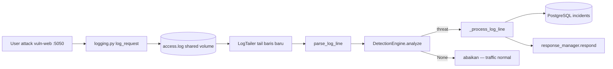

# PEMAHAMAN INCIDENTRA — HULU KE HILIR FILE BY FILE

> **Cara pakai file ini** (baca ini dulu sebelum isi apapun):
> 1. Jalankan aplikasinya (`docker compose up`), buka browser.
> 2. Pilih satu section di bawah (mulai dari #1 — Login & Register). Klik-klik fitur itu di UI.
> 3. Buka file-file yang tercantum di tabel "Files terlibat", tekan **Ctrl+F**, cari kata di kolom "Anchor" — itu langsung lompat ke fungsi intinya. Baca sekilas.
> 4. Isi bagian **"Pemahaman saya"** dengan bahasamu sendiri — sepotong-sepotong juga tidak masalah, ini draft internal, bukan laporan resmi.
> 5. Tulis pertanyaan spesifik di **"Pertanyaan saya"**, dinomori (Q1, Q2, ...). Makin spesifik makin cepat & akurat dijawab — sebut nama fungsi/file kalau tahu.
> 6. Kirim section itu ke saya (paste atau `@` file ini + nomor section). Saya isi **"Jawaban"** dengan referensi baris kode asli, tidak akan menjawab dari ingatan/asumsi.
> 7. Setelah satu section beres dan kamu paham, lanjut ke section berikutnya. Tidak perlu urut kalau ada yang lebih penasaran duluan.
>
> **Kenapa formatnya begini:** supaya kamu yang mengarahkan (kamu yang tahu bagian mana yang masih buram), saya cuma menjawab presisi — bukan saya yang mendikte alur pemahamanmu.
>
> **Kalau minta "rapihkan":** yang dilakukan = perbaiki struktur (heading, checklist, koreksi salah), **bukan** meringkas catatan kamu. Tabel/diagram hanya **suplemen** di bawah poin nomor kamu — bukan pengganti.

**Status pengerjaan** (update manual, centang kalau section sudah "klik" di kepala):

- [x] 1. Login & Self-Registration
- [~] 2. Dashboard — flow + CHART 1 OK; widget lain cukup "Dashboard lite" (lihat Section 2)
- [~] 3. Log Ingestion → Detection — **vuln-web + log_parser + log_monitor selesai**; sisa **`detection_engine.analyze()`** (Section 3) + **`respond()`** (Section 4)
- [ ] 4. Automated Response (block/rate-limit/escalation)
- [ ] 5. Incident Detail + AI Explanation (Groq) — fix parser Groq sudah di kode; belum isi pemahaman
- [ ] 6. IP Management (Blocked/Rate Limited/Whitelist)
- [ ] 7. Detection Rules CRUD + rules_dirty reload
- [~] 8. Notifications + AbuseIPDB — AbuseIPDB baris 196–214 log_monitor sudah dipahami; notifikasi email/Telegram belum
- [ ] 9. Settings + User Management (RBAC) + Audit Log
- [ ] 10. Docker Compose — bagaimana 6 service saling terhubung

---

## Pemahaman base utama (boot frontend)

1. Browser pertama kali muat `frontend/public/index.html` — halaman HTML kosong + `<div id="root">`.
2. `frontend/src/index.js` mount React: `ReactDOM.createRoot(...).render(<App />)`.
3. `frontend/src/App.js` memutuskan auth + routing: belum login → `/login` (Login.js); sudah login → `/` + halaman lain di dalam `Layout`.
4. `frontend/src/components/shared/Layout.js` = sidebar/navbar + area konten (`{children}`). **Bukan** di App.js — App.js hanya routing table.

## 1. Login & Self-Registration

**Files terlibat:**

| Layer | File | Ctrl+F anchor |
|---|---|---|
| Frontend | `frontend/public/index.html` | `#root` |
| Frontend | `frontend/src/index.js` | `createRoot`, `<App />` |
| Frontend | `frontend/src/App.js` | `handleLogin`, `isAuthenticated`, `Navigate` |
| Frontend | `frontend/src/pages/Login.js` | `Ctrl+F` (baris 1) → `handleLogin`, `handleRegister` |
| Frontend | `frontend/src/services/api.js` | `login`, `register` |
| Backend | `backend/app/api/auth.py` | `Ctrl+F` (baris 1) → `login`, `register`, `_make_token`, `_register_rate_limited` |
| Backend | `backend/app/api/auth_middleware.py` | `verify_token` |
| Backend | `backend/app/models/__init__.py` | `class User` |

**Alur (isi sendiri sambil klik-klik):**

 
1. klik login menggunakan admin credentials yang sudah di seed, berhasil masuk
2. klik login menggunakan username yang tidak terdaftar, tidak berhasil masuk 
3. register harus menggunakan 2 persyaratan password, sama dengan confirmation field & 8 char length
4. saat berhasil registrasi harus approval admin terlebih dahulu.


**Pemahaman saya:**

1. Login memanggil function handleLogin untuk mengirim request `POST` login ke backend melalui `api.js`, Register melakukan hal yang mirip dengan login, yaitu melalu perantara file `api.js` dia mengirim request ke backend untuk registrasi menggunakan function handleRegister.
2. File `api.js` menggunakan library axios untuk melakukan proses request atau pemanggilan ke backend url yang bisa diset file ENV Frontend dengan fallback URL yang bisa di set di file api.js langsung.
3. Endpoint restAPI yang berupa URL prefix sebagai blueprint yang berasal dari `backend/app/__init__.py` file tersebut mengimport setiap file blueprint di dalam folder `backend/app/api` lalu melakukan `register_blueprint`, tidak semua file di dalam `backend/app/api` adalah blueprint, ada sebagian cuma helper.
4. route `/login` berasal dari file `auth.py` yaitu `@auth_bp.route('/login', methods=['POST'])` lalu frontend mengirim POST request dengan payload json username dan password melalui `api.js`.
5. route `/register` persis dengan route `/login`, dari `@auth_bp.route('/register', methods=['POST'])` dan frontend memanggilnya melalui `api.js` untuk mengirim POST request daftar payload username, email, & password (confirmPassword hanya divalidasi di frontend). Setelah berhasil daftar user otomatis `status=pending`, `role=None` — terdaftar di database sebelum admin assign role di User Management.
6. Terdapat perlindungan anti spam register: `_register_rate_limited()` di Redis (max 5/jam per IP) — **beda** dari rate limit IP attack di vuln-web (Redis + `rate_limited.json`).
7. File blueprint `auth.py` untuk logic login/register. Selain `/login` dan `/register`, ada `GET /users` (`list_users`) — dipakai `IncidentDetail.js` untuk dropdown assign incident (bukan halaman User Management; itu `GET /api/users/` di `users.py`).
8. Setelah POST login, backend `auth.py` cocokkan username + `check_password_hash` via SQLAlchemy. Jika OK, `_make_token()` generate JWT → response `{ token, user }` → `Login.js` panggil `onLogin(res.data.token)`.
9. `App.js` `handleLogin(token)` simpan ke `localStorage` (`incidentra_token`), set `isAuthenticated=true` → React Router `<Navigate to="/" />` → Dashboard.

kesimpulan:

1. User submit form → handleLogin / handleRegister di Login.js
2. Panggil login() / register() di api.js (axios)
3. Request ke http://localhost:5000/api + path (ENV atau fallback)
4. Flask: blueprint prefix /api/auth (__init__.py) + route /login (auth.py) = /api/auth/login
5. Backend proses → balikin JSON → frontend simpan token / tampilkan pesan

Frontend React memanggil backend Flask lewat axios di api.js. Base URL di-set via environment variable dengan fallback localhost:5000/api. Backend memakai Flask Blueprint — prefix /api/auth diregister di app factory, route /login didefinisikan di auth.py, sehingga endpoint penuh menjadi POST /api/auth/login.

**Pertanyaan saya:**

- Q1. Apakah sudah cukup aman secara keamanan? mengingat web SOC adalah web keamanan pasti akan ditanyai mengenai hal ini, implementasi keamanan web SOC itu sendiri.

**Jawaban:**

- **A1.** Cukup untuk capstone SME dengan catatan berikut:
  - **Password:** disimpan sebagai hash scrypt (Werkzeug `generate_password_hash` / `check_password_hash`), tidak plain text di DB.
  - **Login:** error unified `invalid_credentials` (username salah = password salah) — anti user enumeration.
  - **JWT:** HS256, signed `SECRET_KEY`, expire 24 jam; setiap API call diverifikasi `verify_token()` dari helper `backend/app/api/auth_middleware.py` + cek status user live di DB (pending/suspended ditolak meski token masih ada).
  - **Register:** rate limit Redis 5/jam per IP; password min 8 char; akun pending sampai admin approve + assign role.
  - **Transport:** production wajib HTTPS — payload login terlihat di DevTools browser user sendiri (normal), bukan celah remote.
  - **Keterbatasan scope:** belum 2FA, belum refresh-token rotation — acceptable untuk capstone; bisa disebut sebagai future work di sidang.

---

## 2. Dashboard (KPI cards, charts, globe)

**Files terlibat:**

| Layer | File | Ctrl+F anchor |
|---|---|---|
| Frontend | `frontend/src/App.js` | `Dashboard`, `isAuthenticated`, route `/` |
| Frontend | `frontend/src/pages/Dashboard.js` | `fetchStats`, `CHART 1`, `checkLogStatus` |
| Frontend | `frontend/src/services/api.js` | `getDashboardStats`, `getLogStatus` |
| Frontend | `frontend/src/components/dashboard/AttackOriginsGlobe.js` | *(globe — data `top_countries`)* |
| Backend | `backend/app/api/dashboard.py` | `get_stats`, `log_status`, `timeline_raw` |

**Library yang dipakai di Dashboard.js:**

| Library | Fungsi |
|---|---|
| `@mui/material` + `@mui/icons-material` | Layout, Card, Grid, Chip, CircularProgress, dll. |
| `react-chartjs-2` (`Line`, `Doughnut`, `Bar`) | Wrapper React untuk Chart.js |
| `chart.js` | Engine chart (register scale/element di baris register) |
| `react-globe.gl` (via `AttackOriginsGlobe.js`) | Globe 3D attack origins — lazy load |

**Pemetaan section UI → data backend:**

| Section di layar | Field JSON dari `GET /api/dashboard/stats` | Chart / komponen |
|---|---|---|
| Header + refresh | `lastRefresh` (frontend only) | — |
| Warning kuning "No logs in 60s" | `GET /api/dashboard/log-status` → `{ stale: true }` | — |
| System Status banner | `system_status` | `SystemStatusBanner` |
| Total Incidents | `total_incidents` | `StatCard` |
| Last 24 Hours | `last_24h` | `StatCard` |
| Blocked IPs | `blocked_ips` | `StatCard` |
| MTTR | `mttr_minutes` | `StatCard` |
| Incident Timeline (7 days) | `timeline[]` → `{ date, count }` | **CHART 1** — `Line` (`timelineData`) |
| By Severity | `severity_breakdown[]` | **CHART 2** — `Doughnut` (`severityData`) |
| Severity Trend (7 days) | `severity_timeline[]` | **CHART 3** — `Line` multi-series (`severityTrendData`) |
| Attack Origins globe | `top_countries`, `geo_enriched_7d`, `last_7d` | **Globe** — `AttackOriginsGlobe` |
| Attack Types | `attack_breakdown[]` | **CHART 5** — `Bar` (`attackData`) |
| Top Attacking IPs | `top_attacking_ips[]` | list + `LinearProgress` (bukan Chart.js) |

**Alur:**

1. Setelah login, React Router arahkan ke `/` → render `Dashboard.js`
2. `useEffect` panggil `fetchStats()` + `checkLogStatus()` sekali saat mount
3. `fetchStats` → `getDashboardStats()` di `api.js` → `GET http://localhost:5000/api/dashboard/stats` (JWT di header dari interceptor)
4. Backend `dashboard.py` `get_stats()` query PostgreSQL (`incidents`, `blocked_ips`) → return JSON agregat
5. Frontend simpan ke `stats` state → siapkan `timelineData`, `severityData`, dll. → render chart
6. Auto-refresh: stats tiap 15s (`REFRESH_INTERVAL`), log-status tiap 30s
7. Tombol refresh manual memanggil `fetchStats()` lagi

**Pemahaman saya:**

1. Setelah login sukses, route diarahkan ke `/` → render `Dashboard.js`. Di DevTools Network: request `login` (dapat token) lalu `stats` (dengan header `Authorization: Bearer ...`).
2. Saat pertama buka Dashboard (**mount**), `useEffect` jalankan `fetchStats()` + `checkLogStatus()` → data tampil.
3. `fetchStats()` → `getDashboardStats()` di `api.js` → `GET /api/dashboard/stats` → `dashboard.py` `get_stats()`.
4. Response JSON → `setStats(res.data)`. `stats` dari `useState(null)` — setter-nya `setStats`.
5. `checkLogStatus()` poll tiap **30 detik**; backend anggap stale jika tidak ada log **60 detik** (`stale: true` → banner kuning).
6. Angka 0 di UI = DB belum ada incident — bukan error frontend.

**CHART 1 — Incident Timeline (7 Days)** — sudah dipahami hulu→hilir:

- `fetchStats()` → `get_stats()` → query `timeline_raw` (COUNT incident GROUP BY date, 7 hari)
- `_fill_timeline()` isi hari tanpa incident dengan `count: 0`
- JSON field `timeline` → frontend `setStats(res.data)`
- Pisah jadi `timelineCounts` (sumbu Y) + `timelineLabels` (sumbu X, `formatChartDay`)
- Gabung `timelineData` format Chart.js → `<Line data={timelineData} />` (kiri atas, garis cyan)

**Belum dipelajari detail:** CHART 2, 3, 5, Globe, Top IPs list.

**Pertanyaan saya:**

- Q1. (kosong — lanjut belajar chart lain nanti)

**Jawaban:**

- A1. —

---

## 3. Log Ingestion → Detection

> **Status:** vuln-web ✅ | log_parser ✅ | log_monitor ✅ | **`analyze()` berikutnya** → Section 4 `respond()`

**Files terlibat:**

| Layer | File | Ctrl+F anchor | Peran singkat |
|---|---|---|---|
| Target app | `vuln-web/middleware/logging.py` | `log_request`, `POST_DATA` | Tulis baris log (NCSA + body POST) ke file atau push HTTP |
| Docker | `docker-compose.yml` | `vuln_logs`, `WEB_SERVER_LOG_PATH` | Volume shared: vuln-web tulis, backend tail |
| Backend startup | `backend/docker_entrypoint.sh` | `docker_log_monitor.py` | Monitor jalan terpisah dari Gunicorn (Docker) |
| Backend startup | `backend/run.py` | `start_monitor` | Monitor jalan saat `python run.py` (dev manual) |
| Backend | `backend/docker_log_monitor.py` | `start_monitor` | Process standalone tail log di container |
| Backend | `backend/app/core/log_parser.py` | `parse_log_line`, `LogTailer`, `POST_DATA_PATTERN` | String log → dict `{ ip, method, path, query, ... }` |
| Backend | `backend/app/core/log_monitor.py` | `_process_log_line`, `ingest_log_lines`, `start_monitor` | Orkestrator: parse → detect → incident → response |
| Backend | `backend/app/core/detection_engine.py` | `DETECTION_PATTERNS`, `analyze`, `BruteForceTracker` | Regex + threshold → threat dict atau `None` |
| Backend | `backend/app/models/__init__.py` | `class Incident`, `class DetectionRule` | Row incident + rule match_count |
| Backend (opsional) | `backend/app/api/internal.py` | `ingest_logs` | Hanya deployment terpisah (Railway); Docker pakai shared file |
| Backend (opsional) | `backend/app/api/detection.py` | `inject` | Manual inject log untuk testing |

**Diagram alur (hulu → hilir):**



> **Status Section 3:** vuln-web ✅ | `log_parser.py` (LogTailer + parse_log_line) ✅ | `log_monitor.py` ✅ | `detection_engine.analyze()` ⬜ berikutnya

**Alur langkah demi langkah:**

1. [x] Attacker kirim request ke vuln-web (contoh SQLi di query/form)
2. [x] `logging.py` `log_request()` — setelah response, format baris NCSA Combined Log
3. [x] Kalau POST: append `POST_DATA:key=val&...` supaya detection bisa baca body (bukan cuma URL)
4. [x] Docker: tulis ke `/app/logs/access.log` (vuln-web) = `/app/watched_logs/access.log` (backend) via volume `vuln_logs`
5. [x] `docker_log_monitor.py` → `start_monitor()` → `LogTailer` poll file tiap ~1 detik
6. [x] Baris baru → `_process_log_line(line, ...)`
7. [x] `parse_log_line()` — regex `NGINX_PATTERN` + strip/merge `POST_DATA` ke field `query` (Langkah A–D)
8. [ ] `DetectionEngine.analyze(entry)` — gabung string `method path query user_agent`, match regex DB + baseline OWASP
9. [ ] Kalau match → threat dict; kalau tidak → return `None`, selesai
10. [x] Dedup: skip jika IP+attack_type sama sudah ada incident dalam **5 menit** (kecuali waiver unblock)
11. [x] Buat row `Incident` di PostgreSQL, commit, `rule.match_count++` kalau rule DB aktif
12. [~] `responder.respond(threat, incident.id)` → **Section 4** (tahu dipanggil; detail block belum)
13. [x] Background thread AbuseIPDB (kalau API key ada) — **bukan** AI; lihat sub-bagian di bawah
14. [~] Dashboard `/stats` baca tabel `incidents` → angka/chart berubah (konsep OK; latihan hands-on belum semua)

**Mode log monitor (env):**

| Env | Perilaku |
|---|---|
| Docker Compose | `USE_SIMULATED_LOGS=false` → tail **access.log nyata** dari vuln-web |
| Dev `run.py` | Sama — `start_monitor` di `__main__` |
| `USE_SIMULATED_LOGS=true` | `SimulatedLogFeeder` — demo tanpa vuln-web (jarang dipakai production) |

**Isi `parse_log_line` output (hafal keys ini):**

| Key | Dari mana |
|---|---|
| `ip` | Client IP di baris log |
| `method` | GET / POST / … |
| `path` | Path URL (decoded) |
| `query` | Query string + **POST_DATA** digabung |
| `user_agent` | UA string |
| `status_code` | HTTP status response |
| `raw` | Baris log asli (truncated di incident) |

**Isi `analyze()` — urutan logic:**

1. Skip kalau IP di **whitelist** (`BlockedIP.is_whitelist=True`)
2. Reload rules dari DB kalau `rules_dirty` (Redis) — Section 7
3. Loop compiled regex per `attack_type` (SQL_INJECTION, XSS, PATH_TRAVERSAL, …)
4. Brute force: POST ke path login + threshold Redis (`BruteForceTracker`) — bukan regex
5. Kalau banyak match → ambil **severity tertinggi** (`score`)
6. Return threat dict atau `None`

**Attack types baseline (hardcoded di `DETECTION_PATTERNS`):**

| Type | Cara detect | Severity default |
|---|---|---|
| SQL_INJECTION | Regex di query/path/POST_DATA | critical |
| XSS | Regex tag/script/event handler | critical |
| PATH_TRAVERSAL | `../`, `/etc/passwd`, dll. | high |
| COMMAND_INJECTION | `;whoami`, `cmd=`, dll. | critical |
| FILE_UPLOAD | ekstensi berbahaya di POST_DATA | high |
| SCANNER | UA/tool scanner | medium |
| BRUTE_FORCE | threshold POST login | high |

**Shared volume (Docker) — bukan 1 service barengan:**

```
vuln_web container          backend container
/app/logs/access.log   ←→   /app/watched_logs/access.log
         └──── volume vuln_logs (disk shared) ────┘
```

6 service = 6 container terpisah. Volume = folder disk yang di-mount ke 2+ container (path di dalam container boleh beda, file sama).

**Pemahaman saya — vuln-web (selesai):**

1. `app.py` membuat Flask app vuln-web. Tidak berisi route handler — handler ada di `routes/*.py`, didaftarkan lewat `register_blueprints(app)` dari `routes/__init__.py`.
2. Setiap HTTP request: `@app.before_request` → `enforce_security()` (cek block/rate-limit); route handler di `routes/*.py`; `@app.after_request` → `log_request(response)`.
3. `enforce_security()` (`security.py`) baca blocklist dari JSON file (`blocked_ips.json`, `rate_limited.json`) yang **ditulis backend** ke shared volume. Match IP → 403/429. Railway terpisah: `_fetch_blocklist_remote()` GET ke `/api/internal/blocklist`.
4. `get_client_ip(request)` dari **`vuln-web/ip_utils.py`** (bukan backend). Prioritas: `X-Real-IP` → `X-Forwarded-For` (IP pertama) → `remote_addr` (Docker lokal).
5. `log_request(response)` (`logging.py`): **`request`** (Flask global) untuk method, path, form POST → `POST_DATA:`; **`response`** (parameter dari after_request) untuk status code & content length — POST_DATA bukan dari response object.
6. Langkah logging: kumpulkan POST body → (opsional) `g.log_extra` → susun baris NCSA → append ke `access.log` (Docker/manual) atau push `LOG_INGEST_URL` (Railway).
7. GET attack payload ada di URL (query string), sudah tercatat di log tanpa `POST_DATA`. POST attack sering butuh suffix `POST_DATA:`.

**Pemahaman saya — backend (`log_parser.py`):**

**Kondisi sebelum file ini berjalan:**
`logging.py` menyimpan isi body request ke suffix `POST_DATA:` karena Nginx access log standar TIDAK menyertakan body. Setelah itu disusun menjadi format NCSA yang disimpan ke shared volume `vuln_logs` (Docker) atau di-push lewat `LOG_INGEST_URL` (Railway).

#### `LogTailer` — baca file real-time (dipakai di `start_monitor` → `feeder.tail()`)

1. `LogTailer()` berfungsi untuk membaca file log secara real-time; outputnya berupa 1 baris log (string) per yield — input untuk `parse_log_line()`.
2. `_get_inode(self)` mengecek apakah file masih file yang sama di disk, dengan cara cek unique ID (`st_ino`) pada filesystem — berguna kalau log di-rotate (file diganti).
3. `tail(self)` generator: yield 1 baris log satu per satu ke loop `for line in feeder.tail()` di `_run()`.
4. `f.seek(0, 2)` loncat ke akhir file (EOF) saat startup — skip log lama; hanya proses baris **baru** setelah backend restart.
5. `self._pos` = bookmark byte — posisi terakhir sudah dibaca; supaya tidak baca ulang baris yang sama.
6. Loop `while True` (background thread): bila file diganti (rotation) atau di-truncate (dikosongkan) → reset `self._pos = 0`.
7. Alur baca: `f.seek(self._pos)` → `readlines()` ambil baris baru saja → update `_pos` → `yield line` → `_process_log_line(line)` di `log_monitor.py`.
8. `time.sleep(self.poll_interval)` tunggu 1 detik sebelum cek lagi — hemat CPU (bukan busy-wait terus).

**Referensi cepat (tabel — suplemen, bukan pengganti poin di atas):**

| # | Bagian | Fungsi singkat |
|---|---|---|
| 1 | `__init__` | Path file + poll interval |
| 2 | `_get_inode()` | Deteksi log rotation |
| 3–8 | `tail()` | Loop baca baris baru → yield |

> **Catatan:** `SimulatedLogFeeder` (class lain di file yang sama) hanya dipakai kalau `USE_SIMULATED_LOGS=true` — data hardcoded, bukan tail file nyata.

#### `parse_log_line(line)` — string → dict

1. `parse_log_line()` mengambil 1 baris log string, memisahkan suffix `POST_DATA`, menyisakan baris NCSA murni (tanpa suffix).
2. Pemisahan pakai regex `POST_DATA_PATTERN` (suffix body) dan `NGINX_PATTERN` (baris NCSA standar).
3. Data dipecah path vs query string URL (untuk GET attack): library `urllib` (`urlparse`, `unquote_plus`) memecah `/search?q=%3Cscript%3E` → `path='/search'`, `query='q=%3Cscript%3E'` lalu decode `%3C → <`, `%3E → >`, `%20`/`+` → spasi.
4. **Langkah D (POST):** URL sering tidak punya `?` → setelah Langkah C `query` kosong; isi body dari `post_data` (hasil potong `POST_DATA:`) digabung ke `query` → detection engine scan field `query`.
5. Return dict `{ ip, method, path, query, user_agent, status_code, raw }` — parser **tidak** deteksi serangan; hanya string → dict.

**Langkah A–D (ringkas):**

| Langkah | Apa | Contoh |
|---|---|---|
| A | Potong suffix `POST_DATA:...` | `post_data` = isi body form |
| B | Regex NCSA → ip, method, path, status, ua | `"POST /login HTTP/1.1"` |
| C | `urlparse` + `unquote_plus` (GET) | `%3Cscript%3E` → `<script>` |
| D | `query += post_data` (POST) | `query = username=hello&password=` |

**Contoh GET XSS:** `full_path='/search?q=%3Cscript%3E...'` → setelah C: `path='/search'`, `query='q=<script>...'`

**Contoh POST login (Burp):** `full_path='/login'` → C: `query=''` → D: `query='username=hello&password='`

**Catatan baris 51 — `' ' + m.group(1)` (spasi di dalam petik memang sengaja):**

- Regex `POST_DATA_PATTERN` hanya menangkap isi **setelah** teks `POST_DATA:` → `group(1)` = `username=hello&password=` (tanpa spasi di depan).
- Di log asli ada spasi **sebelum** kata `POST_DATA:` (antara `"Mozilla..."` dan `POST_DATA:`).
- `' '` = string Python berisi **1 karakter spasi** — ditambah di depan isi body supaya saat digabung ke `query` ada pemisah kalau URL sudah punya query string.
- Baris `.strip()` buang spasi ujung — kalau `query` kosong, hasil akhir tetap `username=hello&password=` (tanpa spasi depan).

**Hubungan logging.py ↔ log_parser.py (tidak saling import):**

```
logging.py:  request.form → string ' POST_DATA:username=hello&password=' → access.log
log_parser.py: baca string → POST_DATA_PATTERN + NGINX_PATTERN → dict entry
```

---

**Pemahaman saya — backend (`log_monitor.py`):**

#### `start_monitor()` & `_run()` — background thread

1. `start_monitor()` dipanggil saat startup backend — dari `backend/run.py` (dev manual) atau `backend/docker_log_monitor.py` (Docker/Railway, proses terpisah dari Gunicorn).
2. Variable module-level (`_monitor_thread`, `_running`, `last_log_received_at`) diubah pakai `global` supaya `stop_monitor()` bisa hentikan loop dari luar — bukan variable lokal function saja.
3. `touch_last_log_received(redis_client)` mencatat waktu log terakhir diterima — di memori proses ini + (kalau ada) Redis key `log_monitor:last_received_at` untuk Dashboard banner stale.
4. `_run()` adalah **inner function** — body thread background. Tanpa ini, loop `feeder.tail()` akan block `start_monitor()` dan Flask/Gunicorn tidak bisa lanjut serve API.
5. `_run()` import lazy: `LogTailer` / `SimulatedLogFeeder` dari `log_parser.py`, `DetectionEngine` dari `detection_engine.py`, `ResponseManager` dari `response_manager.py`.
6. Helper `resolve_web_log_path()` baca lokasi file log dari ENV `WEB_SERVER_LOG_PATH` (Docker: `/app/watched_logs/access.log`).
7. `feeder = LogTailer(log_path)` — yield 1 baris log dari `access.log` (lihat pemahaman LogTailer di atas).
8. `engine = DetectionEngine(redis_client=redis_client)` + `register_detection_engine(engine)` + `responder = ResponseManager(db=db, redis_client=redis_client, app=app)` dibuat **sekali** sebelum loop — tidak dibuat ulang per baris (hemat resource).
9. Method crucial: `engine.analyze(entry)` → threat dict; `responder.respond(threat, incident.id)` → block/rate-limit.
10. `with app.app_context():` — method bawaan Flask pada object `app` dari `create_app()` (`backend/app/__init__.py`). SQLAlchemy query butuh Flask context di background thread.
11. Loop `for line in feeder.tail():` — `line` = string 1 baris log. Jika global `_running` di-set `False` (`stop_monitor()`), break keluar loop. Loop tidak selesai sendiri kecuali backend stop.
12. Tiap iterasi: `_process_log_line(line, engine, responder, db, redis_client, app)`.
13. `_monitor_thread = threading.Thread(target=_run, daemon=True, name='LogMonitor')` — `target=_run` = function yang dijalankan thread; `daemon=True` = mati otomatis kalau proses utama mati; `.start()` = baru di sini `_run()` mulai jalan (non-blocking).
14. `start_monitor()` langsung return setelah `.start()` — **tidak** tunggu loop selesai.

#### `_process_log_line()` — Parse → detect → dedup → incident → respond

1. Proses lengkap terbuatnya incident dan response: `Parse → detect → dedup → incident → respond`.
2. Import lazy: `parse_log_line()` dari `log_parser.py`; model PostgreSQL dari `app.models` (`Incident`, `DetectionRule`, enum severity/status).
3. `touch_last_log_received(redis_client)` — catat "log terakhir diproses jam berapa". Dashboard baca via `get_last_log_received_at()` → banner kuning kalau stale >60s.
4. `entry = parse_log_line(line)` — string → dict. `threat = engine.analyze(entry)` — dict → threat dict atau `None` (bukan threat → selesai, tidak INSERT). **Detail `analyze()` belum dipelajari — berikutnya.**
5. **Dedup:** `skip_dedup = False` default (dedup **aktif**). Kalau `not skip_dedup`: query **SELECT** PostgreSQL — incident dengan IP + `attack_type` sama dalam 5 menit? Jika **sudah ada** → `return None` (**dedup skip**, bukan INSERT). Jika **belum ada** → lanjut INSERT. `skip_dedup = True` hanya setelah admin unblock IP (waiver Redis 1×, 10 menit) — untuk testing/demo.
6. **Severity:** `sev_map` = jembatan string dari `analyze()` (mis. `'high'`) → enum SQLAlchemy `SeverityLevel.HIGH` untuk kolom DB. Default fallback: `MEDIUM`.
7. **Detection rule:** `DetectionRule.query.filter_by(attack_type=..., is_active=True).first()`. Jika ketemu → isi `rule_id` + `match_count += 1`. **Jika tidak ketemu → `rule_id = None`, incident tetap dibuat** (match dari baseline OWASP di engine, bukan rule DB). *(Koreksi: bukan `return None`.)*
8. Buat object `incident = Incident(...)` — isi dari `threat` dict: `source_ip`, `attack_type`, `severity`, `status=IncidentStatus.NEW`, `raw_payload`, `request_path`, `request_method`, `user_agent`, `response_code`, `rule_id`.
9. `db.session.add(incident)` lalu `db.session.commit()` — **INSERT** ke PostgreSQL. Setelah commit, `incident.id` ada → KPI Dashboard bisa naik.
10. `logger.info(f"[THREAT] ...")` — log backend untuk debugging (`docker compose logs backend`).
11. `responder.respond(threat, incident.id)` — panggil block / rate-limit dari `response_manager.py` → **Section 4**.
12. Urutan sengaja: buat incident **dulu**, baru block — supaya tiket tetap ada di SOC meskipun blocking gagal.
13. **AbuseIPDB (opsional, baris 196–214):** jika `_get_setting('ABUSEIPDB_API_KEY')` diset → buat inner function `_rep_thread()`, jalankan di `threading.Thread` baru. Lihat sub-bagian di bawah.
14. `return incident.id` — ID incident baru (dipakai `ingest_log_lines()` untuk kumpulkan list; loop monitor tidak pakai return value).

#### AbuseIPDB + `threading.Thread` (baris 196–214)

**Pemahaman saya:**

1. Ini **bukan** core pipeline — kalau API key kosong, seluruh blok di-skip, langsung `return incident.id`. Deteksi + incident + block tetap jalan.
2. **Thread** = pekerjaan paralel dalam 1 program Python (bukan proses baru, bukan Celery). Supaya HTTP ke AbuseIPDB (~1–10 detik) **tidak menghambat** loop baca log berikutnya.
3. **Bukan Celery `.delay()`** — tidak masuk antrian Redis. Pola sama dengan notifikasi email di `response_manager._notify_async()`. Celery di project ini cuma cleanup block hourly.
4. Inner function `_rep_thread(app_ref, inc_id, ip)` — body yang dijalankan thread.
5. `with app_ref.app_context():` — thread baru tidak punya Flask context bawaan; SQLAlchemy butuh ini untuk `Incident.query.get()` + `commit()` di `_do_reputation_check`.
6. `_do_reputation_check(inc_id, ip)` di `app/services/threat_intel_service.py` — GET AbuseIPDB → update field `country_code` dan `abuse_confidence_score` pada row incident **yang sudah ada** (bukan buat incident baru).
7. `threading.Thread(target=_rep_thread, args=(app, incident.id, threat['ip']), daemon=True).start()`:
   - `target` = function yang dijalankan
   - `args` = `app` dari parameter `start_monitor`, `incident.id` baru dari commit, IP dari `threat`
   - `daemon=True` = thread mati kalau proses utama restart
   - `.start()` = jalankan non-blocking — caller **tidak tunggu** selesai
8. Thread utama sudah `return incident.id` saat AbuseIPDB mungkin masih jalan — normal. Flag/country di UI bisa muncul beberapa detik kemudian setelah refresh.
9. **Beda AI Groq:** AbuseIPDB = reputasi IP otomatis (opsional). AI Explain = analyst klik manual di UI (Section 5).

**Diagram timing (suplemen visual — bukan pengganti poin di atas):**

```
Thread utama (_process_log_line)          Thread daemon (_rep_thread)
├─ commit incident ✅                      ├─ app.app_context()
├─ respond() block IP ✅                 ├─ _do_reputation_check()
├─ Thread(...).start()  ───────────────►└─ UPDATE country_code, abuse_score
└─ return incident.id  (tidak tunggu)
```

**Dedup — terminologi (suplemen):**

- `skip_dedup = False` → dedup aktif → 100× SQLi sama (IP + type, 5 menit) = **1 incident**
- `return None` di dedup = **dedup skip** (buang baris)
- Query dedup = **SELECT**, bukan INSERT

---

**Ringkas konsep backend (Section 3):**

1. Serangan tidak langsung masuk DB — harus lewat baris log dulu.
2. Backend tidak hook ke vuln-web — tail shared file atau terima push (`internal.py` Railway).
3. Satu baris log = parse → analyze → (optional) incident → respond.
4. Detection = regex + rule DB, **bukan** AI.
5. Dedup 5 menit = anti spam 100 ticket identik.

**Belum dipelajari detail:** `detection_engine.analyze()` (langkah 8–9 checklist).

**Latihan (~1–2 jam):**

1. [x] `docker compose up` — buka vuln-web `:5050`, kirim SQLi (`' OR 1=1--`)
2. [ ] `docker compose logs backend` — cari `[THREAT] SQL_INJECTION from ...`
3. [ ] Buka Incidentra UI → Incidents — row baru muncul?
4. [ ] Dashboard → angka `last_24h` naik?
5. [x] Tail log volume — lihat format `POST_DATA:` (`docker compose exec vuln_web tail access.log`)
6. [ ] Trace 1 baris: copy log line → `parse_log_line` → `analyze`

**Pertanyaan sidang (draft — centang kalau sudah bisa jawab):**

- [x] Q1. Kenapa perlu `POST_DATA` di log, tidak cukup URL saja?
- [x] Q2. Beda detection engine vs AI Groq?
- [x] Q3. Apa yang terjadi kalau log monitor mati? (hint: banner kuning Dashboard `/log-status`)
- [x] Q4. Bagaimana Docker Compose hubungkan vuln-web log ke backend?
- [x] Q5. Kenapa ada dedup 5 menit?
- [x] Q6. Kenapa AbuseIPDB pakai `threading.Thread`, bukan Celery `.delay()`?

**Jawaban:**

- **A1.** Banyak attack (SQLi login, upload shell) ada di **body POST**, bukan URL. Tanpa `POST_DATA`, log cuma path `/login` — detection tidak lihat payload. GET attack tetap terdeteksi dari query string di URL log.
- **A2.** Detection engine = regex/rule di `detection_engine.py`, jalan otomatis per baris log. AI Groq = explain incident **manual** on-demand (`POST /api/incidents/{id}/explain`), bukan deteksi.
- **A3.** Log monitor idle >60s → `GET /log-status` return `stale: true` → banner kuning di Dashboard. Pipeline ingestion mati; incident baru tidak terbuat.
- **A4.** Volume `vuln_logs` di-mount ke vuln-web (`/app/logs`) dan backend (`/app/watched_logs`) — file `access.log` sama. Backend `LogTailer` tail file itu.
- **A5.** Tanpa dedup, 1 attacker kirim 100 request SQLi = 100 incident identik. Dedup 5 menit (IP + attack_type sama) = 1 incident per window.
- **A6.** AbuseIPDB = enrichment **opsional** & lambat (HTTP eksternal). Thread daemon = fire-and-forget di proses yang sama — tidak block log monitor. Celery `.delay()` butuh worker terpisah; di project ini Celery hanya untuk cleanup block hourly. Pola thread sama dengan notifikasi email di `response_manager._notify_async()`.

**One-liner sidang (hafalkan):**

> "vuln-web menulis access log dengan suffix POST body; backend tail file shared volume lewat log monitor, parse ke struct, lalu detection engine match regex OWASP + rule DB; jika threat, buat incident PostgreSQL dan trigger automated response."

---

## 4. Automated Response (block / rate-limit / escalation)

**Files terlibat:**

| Layer | File | Ctrl+F anchor |
|---|---|---|
| Backend | `backend/app/core/response_manager.py` | `Ctrl+F` → `respond`, `_escalating_block`, `_write_blocked_ips_json`, `_apply_rate_limit` |
| Target app | `vuln-web/middleware/security.py` | *(baca blocked_ips.json / rate_limited.json)* |

**Alur:**

1.

**Pemahaman saya:**

-

**Pertanyaan saya:**

- Q1.

**Jawaban:**

- A1.

---

## 5. Incident Detail + AI Explanation (Groq)

**Files terlibat:**

| Layer | File | Ctrl+F anchor |
|---|---|---|
| Backend | `backend/app/api/incidents.py` | `Ctrl+F` → `trigger_explanation`, `simulate` |
| Backend | `backend/app/services/ai_service.py` | `Ctrl+F` → `_call_groq_with_fallback`, `generate_explanation_task`, `_save_fallback_explanation` |

**Catatan penting (sudah terverifikasi ke kode, bukan asumsi):** `trigger_explanation` di `incidents.py` **selalu jalan sinkron** dalam request/response yang sama — tidak ada Celery, tidak ada thread terpisah, di jalur ini. `generate_explanation_task` di `ai_service.py` didaftarkan sebagai Celery task tapi tidak pernah dipanggil `.delay()` di manapun pada kode saat ini.

**Alur:**

1.

**Pemahaman saya:**

-

**Pertanyaan saya:**

- Q1.

**Jawaban:**

- A1.

---

## 6. IP Management (Blocked / Rate Limited / Whitelist)

**Files terlibat:**

| Layer | File | Ctrl+F anchor |
|---|---|---|
| Backend | `backend/app/api/blocked_ips.py` | *(belum ada Ctrl+F anchor)* |
| Backend | `backend/app/api/rate_limited.py` | *(belum ada Ctrl+F anchor)* |

**Alur:**

1.

**Pemahaman saya:**

-

**Pertanyaan saya:**

- Q1.

**Jawaban:**

- A1.

---

## 7. Detection Rules CRUD + rules_dirty reload

**Files terlibat:**

| Layer | File | Ctrl+F anchor |
|---|---|---|
| Backend | `backend/app/api/rules.py` | `Ctrl+F` → `update_rule` (is_active toggle), `create_rule` |
| Backend | `backend/app/core/detection_engine.py` | `_load_rules_from_db`, `_maybe_reload_rules`, `rules_dirty` |

**Alur:**

1.

**Pemahaman saya:**

-

**Pertanyaan saya:**

- Q1.

**Jawaban:**

- A1.

---

## 8. Notifications (Email/Telegram) + AbuseIPDB

**Files terlibat:**

| Layer | File | Ctrl+F anchor |
|---|---|---|
| Backend | `backend/app/core/response_manager.py` | `_notify_async` |
| Backend | `backend/app/services/notification_service.py` | `_do_notify` |
| Backend | `backend/app/services/threat_intel_service.py` | `check_ip_reputation`, `_do_reputation_check` |
| Backend | `backend/app/core/log_monitor.py` | baris yang spawn thread `_do_reputation_check` |

**Catatan penting (terverifikasi ke kode):** Notifikasi email/Telegram **tidak lewat Celery** — dipanggil lewat `threading.Thread(daemon=True)` dari `response_manager._notify_async()`. AbuseIPDB sama — thread dari `log_monitor.py` baris 196–214 (sudah dipelajari di Section 3). Celery Worker hanya menjalankan `cleanup_expired_blocks` (hourly via Beat).

**Alur:**

1.

**Pemahaman saya:**

-

**Pertanyaan saya:**

- Q1.

**Jawaban:**

- A1.

---

## 9. Settings + User Management (RBAC) + Audit Log

**Files terlibat:**

| Layer | File | Ctrl+F anchor |
|---|---|---|
| Backend | `backend/app/api/settings.py` | *(belum ada Ctrl+F anchor)* |
| Backend | `backend/app/api/users.py` | *(belum ada Ctrl+F anchor)* |
| Backend | `backend/app/api/audit.py` | *(belum ada Ctrl+F anchor)* |

**Alur:**

1.

**Pemahaman saya:**

-

**Pertanyaan saya:**

- Q1.

**Jawaban:**

- A1.

---

## 10. Docker Compose — bagaimana 6 service saling terhubung

**Files terlibat:**

| Layer | File | Ctrl+F anchor |
|---|---|---|
| Root | `docker-compose.yml` | nama tiap service, `volumes:`, `depends_on:` |
| Backend | `backend/docker_entrypoint.sh` | urutan startup (migrate → seed → gunicorn) |
| Backend | `backend/celery_worker.py` | `cleanup_expired_blocks`, `beat_schedule` |

**Alur:**

1.
2.
3.

**Pemahaman saya:**

-

**Pertanyaan saya:**

- Q1.

**Jawaban:**

- A1.

---

## Log perubahan (changelog) — supaya kejadian "lupa pernah improvement" tidak terulang

> Isi baris baru tiap kali ada perubahan arsitektur/implementasi signifikan yang mungkin bikin laporan/diagram jadi tidak sinkron dengan kode. Cukup 1 baris.

| Tanggal | Perubahan | File terdampak |
|---|---|---|
| 2026-08-01 | Dokumentasi pemahaman Login + Dashboard CHART 1; komentar Ctrl+F di Dashboard.js | `docs/PEMAHAMAN_PROGRESSIF.md`, `Dashboard.js` |
| 2026-08-01 | Kerangka Section 3 Log Ingestion → Detection (diagram, alur 14 langkah, latihan besok) | `docs/PEMAHAMAN_PROGRESSIF.md` |
| 2026-08-02 | Perbaikan Pemahaman Section 3 (vuln-web selesai, shared volume, koreksi ip_utils/request vs response) | `docs/PEMAHAMAN_PROGRESSIF.md`, `vuln-web/middleware/logging.py` |
| 2026-08-03 | parse_log_line Langkah A–D selesai; komentar blok logging.py + log_parser.py + Login/Dashboard; catatan spasi baris 51 | `log_parser.py`, `logging.py`, `Login.js`, `Dashboard.js`, `auth.py`, `dashboard.py`, `PEMAHAMAN_PROGRESSIF.md` |
| 2026-08-04 | Section 3 dirapikan: LogTailer dipulihkan (tabel), log_monitor + dedup + AbuseIPDB/thread; checklist 5–13 di-update; koreksi rule_id vs return None | `PEMAHAMAN_PROGRESSIF.md` |
| 2026-08-04 | Restore catatan panjang user (LogTailer 8 poin, start_monitor 14 poin, _process_log_line 14 poin, AbuseIPDB 9 poin) — tabel jadi suplemen | `PEMAHAMAN_PROGRESSIF.md` |
